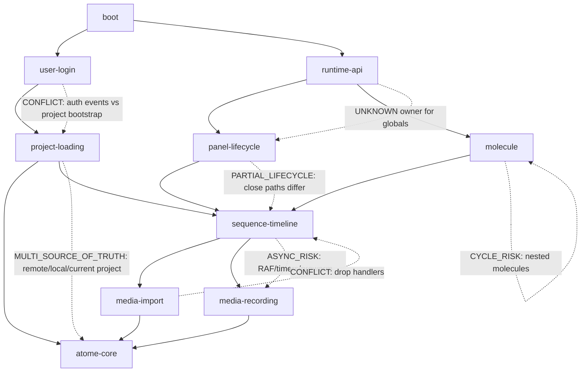
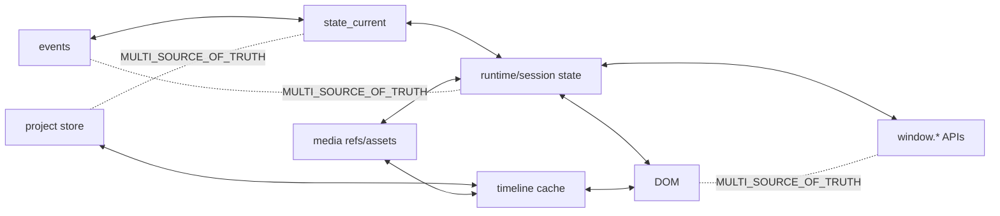

# Graph Index

Point traite: index global des graphes.

Ce document synthétise les graphes créés pour les blocs demandés dans `todo/graph_creation.md`. Le code source n'a pas été modifié; seuls des fichiers Markdown et Mermaid ont été ajoutés sous `docs/graphs/`.

## Points traites

- [x] [molecule](./molecule/README.md)
- [x] [media-import](./media-import/README.md)
- [x] [media-recording](./media-recording/README.md)
- [x] [panel-lifecycle](./panel-lifecycle/README.md)
- [x] [sequence-timeline](./sequence-timeline/README.md)
- [x] [project-loading](./project-loading/README.md)
- [x] [user-login](./user-login/README.md)
- [x] [boot](./boot/README.md)
- [x] [runtime-api](./runtime-api/README.md)
- [x] [atome-core](./atome-core/README.md)

## Structure par bloc

Chaque bloc contient les fichiers suivants:

- `README.md`
- `01-call-graph.md`
- `02-event-graph.md`
- `03-state-graph.md`
- `04-source-of-truth-graph.md`
- `05-async-graph.md`
- `06-lifecycle-graph.md`
- `07-risk-map.md`
- `08-open-questions.md`

Le bloc [boot](./boot/README.md) contient aussi [09-boot-timeline.md](./boot/09-boot-timeline.md).

## Risques critiques transversaux

- `MULTI_SOURCE_OF_TRUTH`: plusieurs blocs maintiennent leur etat a la fois dans le DOM, des singletons `window.*`, des caches runtime, `events`, `state_current`, des objets session et des stores projet.
- `ASYNC_RISK`: plusieurs operations critiques sont lancees en mode detache (`void`, timers, listeners globaux, `requestAnimationFrame`) sans coordination de fermeture ou de rollback.
- `CONFLICT`: les chemins boot, auth, projet, timeline, import media et panel peuvent agir en parallele sur les memes surfaces.
- `PARTIAL_LIFECYCLE`: plusieurs runtimes ont un chemin d'ouverture complet mais une fermeture partielle ou dependante d'evenements externes.
- `CYCLE_RISK`: le bloc molecule protege explicitement les inclusions imbriquees, ce qui indique un risque fonctionnel reel si le garde-fou est contourne.

## Routes concurrentes globales

## Sources de verite principales

## Ordre de correction recommande

1. Stabiliser les proprietaires de `runtime-api` et documenter les singletons `window.*`.
2. Unifier les sources de verite `atome-core`, projet et timeline.
3. Serialiser `project-loading` avec `user-login` pour eviter les bootstraps concurrents.
4. Fermer les cycles de vie incomplets dans `panel-lifecycle`, `sequence-timeline` et `media-recording`.
5. Clarifier les routes concurrentes d'import media et leur priorite de drop.
6. Consolider les chemins d'ouverture/fermeture `molecule`, surtout les sessions imbriquees et les sauvegardes detachees.

## Priorites de debug

- `P0`: project/auth bootstrapping concurrent, car il peut charger ou creer le mauvais projet.
- `P0`: fermeture de panel pendant enregistrement ou persistance timeline active.
- `P1`: conflits de handlers drop entre projet, preview et timeline.
- `P1`: playhead timeline pilote par plusieurs horloges.
- `P1`: ambiguites `window.Molecule` et APIs globales runtime.
- `P2`: listeners globaux, timers et `requestAnimationFrame` sans proprietaire de lifecycle explicite.

## Fichiers par bloc

- [molecule](./molecule/README.md): graphes d'appel, evenement, etat, sources de verite, async, lifecycle, risques, questions.
- [media-import](./media-import/README.md): graphes d'import/drop, resolution media, persistance timeline, risques de concurrence.
- [media-recording](./media-recording/README.md): graphes capture, MediaRecorder/native, persistance, arret et finalisation.
- [panel-lifecycle](./panel-lifecycle/README.md): graphes ouverture/fermeture panel, dock, cleanup, audio et observers.
- [sequence-timeline](./sequence-timeline/README.md): graphes transport, gestures, playhead, prewarm et RAF.
- [project-loading](./project-loading/README.md): graphes bootstrap projet, auth wait, remote/local sync et stale-first load.
- [user-login](./user-login/README.md): graphes login/logout, session state, events auth et anonymous migration.
- [boot](./boot/README.md): graphes chargement modules, readiness, bootstrap intuition, permissions et timeline boot.
- [runtime-api](./runtime-api/README.md): graphes APIs globales, gateway outils, panel API, mtrack API et ambiguities.
- [atome-core](./atome-core/README.md): graphes commit, events, state_current, selection, event bus et Fastify mirror.
