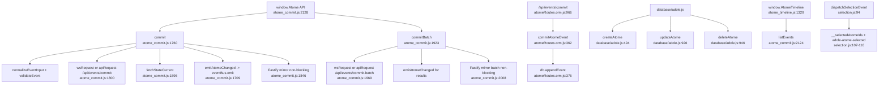

# Call Graph - atome-core

```mermaid
flowchart TD
  WindowAtome["window.Atome API\natome_commit.js:2128"] --> Commit["commit\natome_commit.js:1760"]
  WindowAtome --> Batch["commitBatch\natome_commit.js:1923"]
  Commit --> Normalize["normalizeEventInput + validateEvent"]
  Commit --> Transport["wsRequest or apiRequest /api/events/commit\natome_commit.js:1800"]
  Batch --> BatchTransport["wsRequest or apiRequest /api/events/commit-batch\natome_commit.js:1969"]
  Commit --> State["fetchStateCurrent\natome_commit.js:1596"]
  Commit --> Emit["emitAtomeChanged -> eventBus.emit\natome_commit.js:1709"]
  Batch --> EmitBatch["emitAtomeChanged for results"]
  Commit --> Mirror["Fastify mirror non-blocking\natome_commit.js:1846"]
  Batch --> MirrorBatch["Fastify mirror batch non-blocking\natome_commit.js:2008"]

  Server["/api/events/commit\natomeRoutes.orm.js:966"] --> CommitEvent["commitAtomeEvent\natomeRoutes.orm.js:362"]
  CommitEvent --> DbAppend["db.appendEvent\natomeRoutes.orm.js:376"]
  Db["database/adole.js"] --> Create["createAtome\ndatabase/adole.js:494"]
  Db --> Update["updateAtome\ndatabase/adole.js:926"]
  Db --> Delete["deleteAtome\ndatabase/adole.js:946"]

  Timeline["window.AtomeTimeline\natome_timeline.js:1329"] --> ListEvents["listEvents\natome_commit.js:2124"]
  Selection["dispatchSelectionEvent\nselection.js:94"] --> SelectedGlobal["__selectedAtomeIds + adole-atome-selected\nselection.js:107-110"]
```
