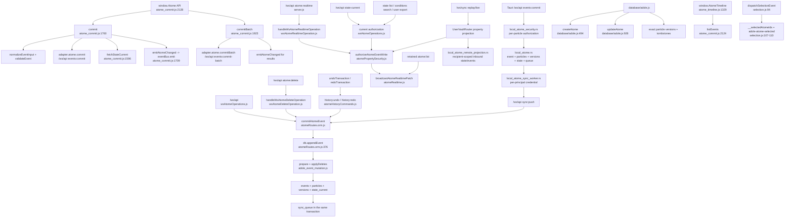

# Call Graph - atome-core

```mermaid
flowchart TD
  WindowAtome["window.Atome API\natome_commit.js:2128"] --> Commit["commit\natome_commit.js:1760"]
  WindowAtome --> Batch["commitBatch\natome_commit.js:1923"]
  Commit --> Normalize["normalizeEventInput + validateEvent"]
  Commit --> Transport["adapter.atome.commit\n/ws/api events:commit"]
  Batch --> BatchTransport["adapter.atome.commitBatch\n/ws/api events:commit-batch"]
  Commit --> State["fetchStateCurrent\natome_commit.js:1596"]
  Commit --> Emit["emitAtomeChanged -> eventBus.emit\natome_commit.js:1709"]
  Batch --> EmitBatch["emitAtomeChanged for results"]
  Server["/ws/api\nwsAtomeOperations.js"] --> CommitEvent["commitAtomeEvent\natomeRoutes.orm.js"]
  CommitEvent --> DbAppend["db.appendEvent\natomeRoutes.orm.js:376"]
  DbAppend --> EventMutation["prepare + applyDeletes\nadole_event_mutation.js"]
  EventMutation --> AtomicProjection["events + particles + versions + state_current"]
  AtomicProjection --> AtomicQueue["sync_queue in the same transaction"]
  DeleteRequest["/ws/api atome:delete"] --> DeleteHandler["handleWsAtomeDeleteOperation\nwsAtomeDeleteOperation.js"]
  DeleteHandler --> CommitEvent
  TimelineHistory["undoTransaction / redoTransaction"] --> HistoryCommand["history:undo / history:redo\natomeHistoryCommands.js"]
  HistoryCommand --> CommitEvent
  Realtime["/ws/api atome:realtime\nserver.js"] --> RealtimeHandler["handleWsAtomeRealtimeOperation\nwsAtomeRealtimeOperation.js"]
  RealtimeHandler --> PropertyWritePolicy["authorizeAtomeEventWrite\natomePropertySecurity.js"]
  PropertyWritePolicy --> RecipientProjection["broadcastAtomeRealtimePatch\natomeRealtime.js"]
  SyncPush["/ws/api sync:push"] --> CommitEvent
  StateRead["/ws/api state-current"] --> ReadProjection["current authorization\nwsAtomeOperations.js"]
  SyncLive["/ws/sync replay/live"] --> SyncProjection["UserVaultRouter property projection"]
  ReadProjection --> PropertyWritePolicy
  SyncProjection --> PropertyWritePolicy
  ConsumerReads["state list / conditions search / user export"] --> ReadProjection
  LegacyList["retained atome:list"] --> RecipientProjection
  TauriCommit["Tauri /ws/api events:commit"] --> NativeSecurity["local_atome_security.rs\nper-particle authorization"]
  NativeSecurity --> NativeAtomic["local_atome.rs\nevent + particles + versions + state + queue"]
  NativeAtomic --> NativeWorker["local_atome_sync_worker.rs\nper-principal credential"]
  NativeWorker --> SyncPush
  SyncProjection --> RemoteProjection["local_atome_remote_projection.rs\nrecipient-scoped inbound state/events"]
  Db["database/adole.js"] --> Create["createAtome\ndatabase/adole.js:494"]
  Db --> Update["updateAtome\ndatabase/adole.js:926"]
  Db --> PropertyVersions["exact particle versions + tombstones"]

  Timeline["window.AtomeTimeline\natome_timeline.js:1329"] --> ListEvents["listEvents\natome_commit.js:2124"]
  Selection["dispatchSelectionEvent\nselection.js:94"] --> SelectedGlobal["__selectedAtomeIds + adole-atome-selected\nselection.js:107-110"]
```
