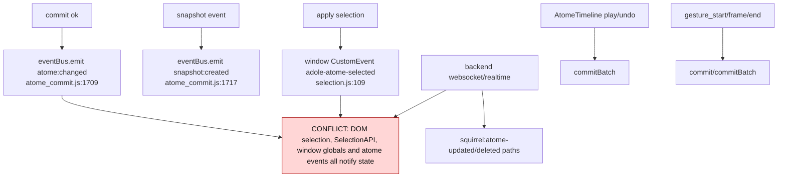

# Event Graph - atome-core

```mermaid
flowchart TD
  CommitOk["commit ok"] --> AtomeChanged["eventBus.emit atome:changed\natome_commit.js:1709"]
  Snapshot["snapshot event"] --> SnapshotCreated["eventBus.emit snapshot:created\natome_commit.js:1717"]
  Selection["apply selection"] --> SelectionEvent["window CustomEvent adole-atome-selected\nselection.js:109"]
  Realtime["backend websocket/realtime"] --> ShareSync["squirrel:atome-updated/deleted paths"]
  TimelinePanel["AtomeTimeline play/undo"] --> CommitBatch["commitBatch"]
  Gesture["gesture_start/frame/end"] --> Commit["commit/commitBatch"]

  Conflict["CONFLICT: DOM selection, SelectionAPI, window globals and atome events all notify state"]:::risk
  AtomeChanged --> Conflict
  SelectionEvent --> Conflict
  Realtime --> Conflict

  classDef risk fill:#ffd6d6,stroke:#a80000,color:#111
```
