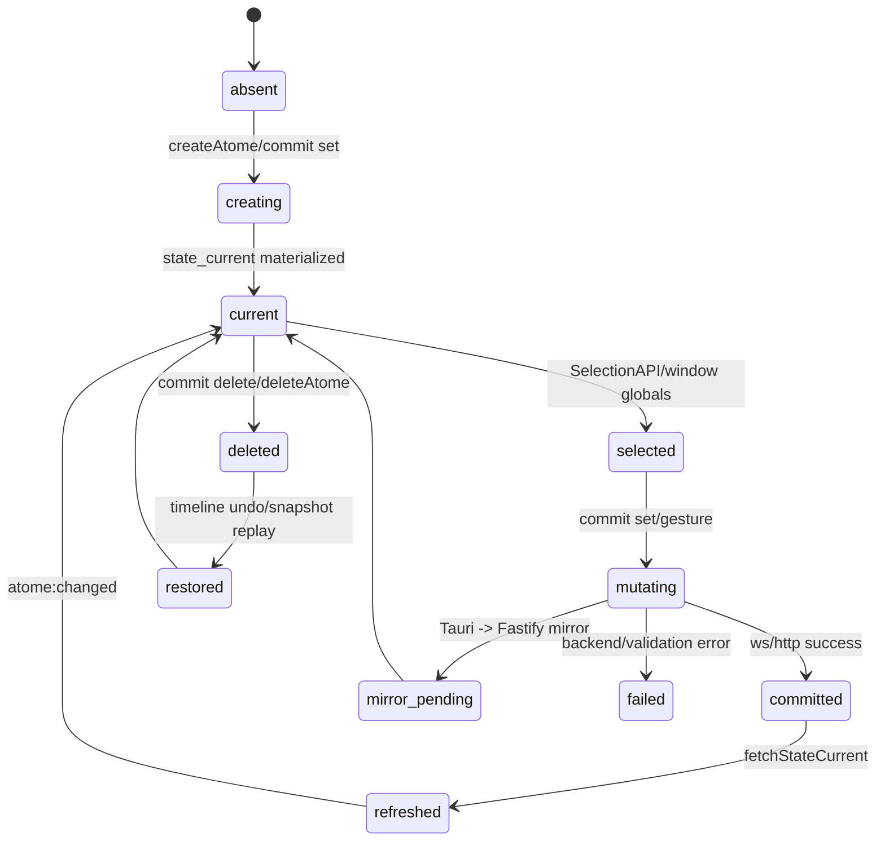

# State Graph - atome-core

```mermaid
stateDiagram-v2
  [*] --> absent
  absent --> creating: createAtome/commit set
  creating --> current: state_current materialized
  current --> selected: SelectionAPI/window globals
  selected --> mutating: commit set/gesture
  mutating --> committed: ws/http success
  committed --> refreshed: fetchStateCurrent
  refreshed --> current: atome:changed
  current --> deleted: commit delete/deleteAtome
  deleted --> restored: timeline undo/snapshot replay
  restored --> current
  mutating --> mirror_pending: Tauri -> Fastify mirror
  mirror_pending --> current
  mutating --> failed: backend/validation error
```
