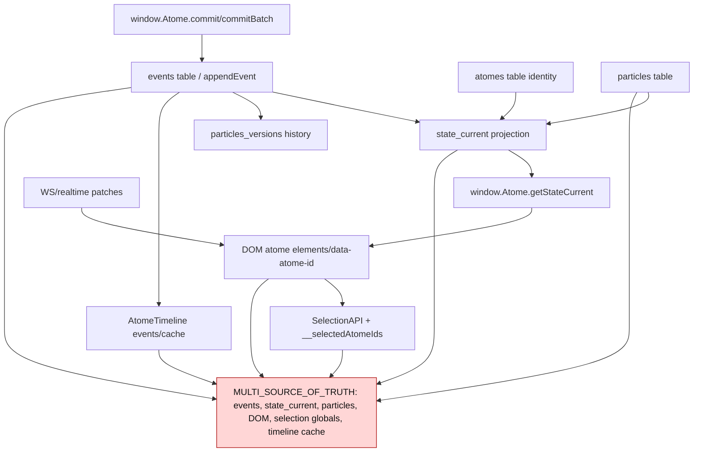

# Source-of-Truth Graph - atome-core

```mermaid
flowchart TD
  Events["events table / appendEvent"] --> StateCurrent["state_current projection"]
  Events --> ParticlesVersions["particles_versions history"]
  Atomes["atomes table identity"] --> StateCurrent
  Particles["particles table"] --> StateCurrent
  StateCurrent --> WindowState["window.Atome.getStateCurrent"]
  WindowState --> DOM["DOM atome elements/data-atome-id"]
  DOM --> Selection["SelectionAPI + __selectedAtomeIds"]
  Events --> Timeline["AtomeTimeline events/cache"]
  Commit["window.Atome.commit/commitBatch"] --> Events
  Realtime["WS/realtime patches"] --> DOM

  Multi["MULTI_SOURCE_OF_TRUTH: events, state_current, particles, DOM, selection globals, timeline cache"]:::risk
  Events --> Multi
  StateCurrent --> Multi
  Particles --> Multi
  DOM --> Multi
  Selection --> Multi
  Timeline --> Multi

  classDef risk fill:#ffd6d6,stroke:#a80000,color:#111
```
