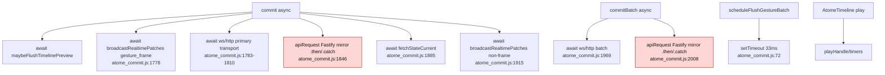

# Async Graph - atome-core

```mermaid
flowchart TD
  Commit["commit async"] --> MaybePreview["await maybeFlushTimelinePreview"]
  Commit --> BroadcastFrame["await broadcastRealtimePatches gesture_frame\natome_commit.js:1778"]
  Commit --> Transport["await ws/http primary transport\natome_commit.js:1783-1810"]
  Commit --> Mirror["apiRequest Fastify mirror .then/.catch\natome_commit.js:1846"]:::risk
  Commit --> Refresh["await fetchStateCurrent\natome_commit.js:1885"]
  Commit --> Broadcast["await broadcastRealtimePatches non-frame\natome_commit.js:1915"]
  Batch["commitBatch async"] --> BatchTransport["await ws/http batch\natome_commit.js:1969"]
  Batch --> MirrorBatch["apiRequest Fastify mirror .then/.catch\natome_commit.js:2008"]:::risk
  GestureBatch["scheduleFlushGestureBatch"] --> Timer["setTimeout 33ms\natome_commit.js:72"]
  Timeline["AtomeTimeline play"] --> TimerLoop["playHandle/timers"]

  classDef risk fill:#ffd6d6,stroke:#a80000,color:#111
```
