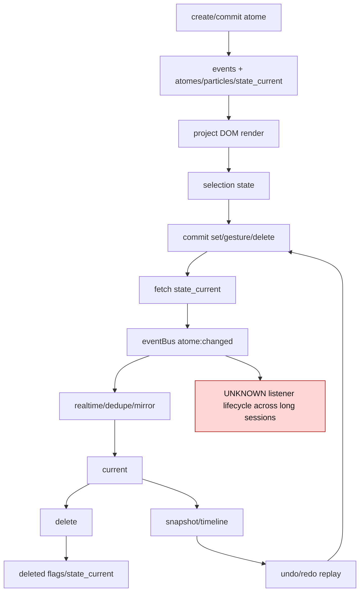

# Lifecycle Graph - atome-core

```mermaid
flowchart TD
  Create["create/commit atome"] --> Store["events + atomes/particles/state_current"]
  Store --> Render["project DOM render"]
  Render --> Select["selection state"]
  Select --> Mutate["commit set/gesture/delete"]
  Mutate --> Refresh["fetch state_current"]
  Refresh --> Notify["eventBus atome:changed"]
  Notify --> Sync["realtime/dedupe/mirror"]
  Sync --> Current["current"]
  Current --> Delete["delete"]
  Delete --> DeletedState["deleted flags/state_current"]
  Current --> Snapshot["snapshot/timeline"]
  Snapshot --> UndoRedo["undo/redo replay"]
  UndoRedo --> Mutate
  Notify --> ListenerLeak["UNKNOWN listener lifecycle across long sessions"]:::risk

  classDef risk fill:#ffd6d6,stroke:#a80000,color:#111
```
