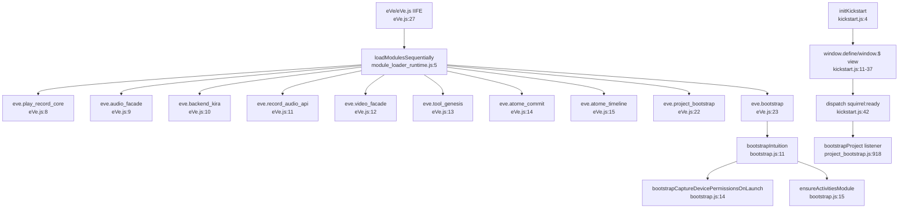

# Call Graph - boot

```mermaid
flowchart TD
  Eve["eVe/eVe.js IIFE\neVe.js:27"] --> Loader["loadModulesSequentially\nmodule_loader_runtime.js:5"]
  Loader --> AudioCore["eve.play_record_core\neVe.js:8"]
  Loader --> AudioFacade["eve.audio_facade\neVe.js:9"]
  Loader --> Kira["eve.backend_kira\neVe.js:10"]
  Loader --> RecordApi["eve.record_audio_api\neVe.js:11"]
  Loader --> VideoFacade["eve.video_facade\neVe.js:12"]
  Loader --> ToolGenesis["eve.tool_genesis\neVe.js:13"]
  Loader --> Commit["eve.atome_commit\neVe.js:14"]
  Loader --> Timeline["eve.atome_timeline\neVe.js:15"]
  Loader --> ProjectBoot["eve.project_bootstrap\neVe.js:22"]
  Loader --> IntuitionBoot["eve.bootstrap\neVe.js:23"]
  IntuitionBoot --> BootIntuition["bootstrapIntuition\nbootstrap.js:11"]
  BootIntuition --> CapturePerm["bootstrapCaptureDevicePermissionsOnLaunch\nbootstrap.js:14"]
  BootIntuition --> Activities["ensureActivitiesModule\nbootstrap.js:15"]
  Kickstart["initKickstart\nkickstart.js:4"] --> View["window.define/window.$ view\nkickstart.js:11-37"]
  View --> Ready["dispatch squirrel:ready\nkickstart.js:42"]
  Ready --> ProjectBoot2["bootstrapProject listener\nproject_bootstrap.js:918"]
```
