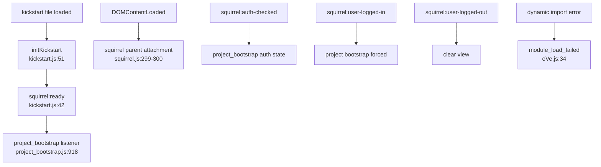

# Event Graph - boot

```mermaid
flowchart TD
  FileLoad["kickstart file loaded"] --> Init["initKickstart\nkickstart.js:51"]
  Init --> Ready["squirrel:ready\nkickstart.js:42"]
  Ready --> ProjectBootstrap["project_bootstrap listener\nproject_bootstrap.js:918"]
  DOMReady["DOMContentLoaded"] --> SquirrelAttach["squirrel parent attachment\nsquirrel.js:299-300"]
  AuthChecked["squirrel:auth-checked"] --> ProjectAuth["project_bootstrap auth state"]
  UserLoggedIn["squirrel:user-logged-in"] --> ProjectReload["project bootstrap forced"]
  UserLoggedOut["squirrel:user-logged-out"] --> ProjectClear["clear view"]
  ModuleError["dynamic import error"] --> BootFail["module_load_failed\neVe.js:34"]
```
