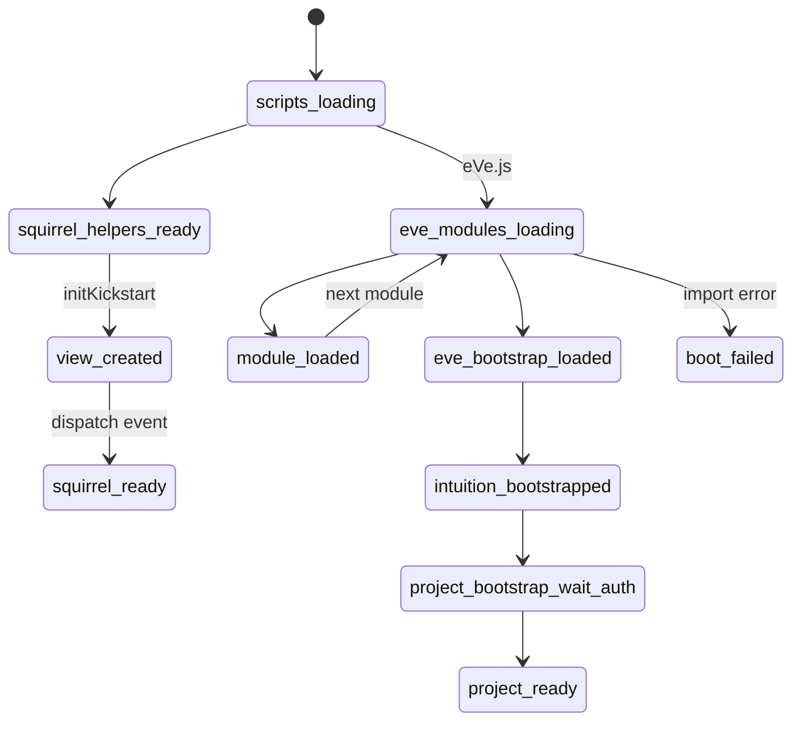

# State Graph - boot

```mermaid
stateDiagram-v2
  [*] --> scripts_loading
  scripts_loading --> squirrel_helpers_ready
  squirrel_helpers_ready --> view_created: initKickstart
  view_created --> squirrel_ready: dispatch event
  scripts_loading --> eve_modules_loading: eVe.js
  eve_modules_loading --> module_loaded
  module_loaded --> eve_modules_loading: next module
  eve_modules_loading --> eve_bootstrap_loaded
  eve_bootstrap_loaded --> intuition_bootstrapped
  intuition_bootstrapped --> project_bootstrap_wait_auth
  project_bootstrap_wait_auth --> project_ready
  eve_modules_loading --> boot_failed: import error
```
