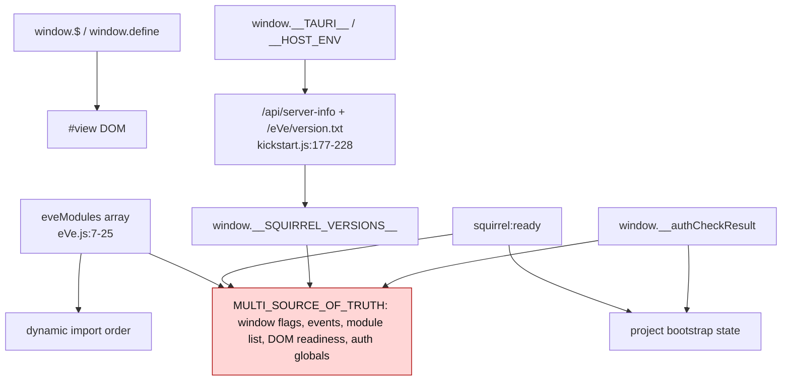

# Source-of-Truth Graph - boot

```mermaid
flowchart TD
  ModuleList["eveModules array\neVe.js:7-25"] --> Loader["dynamic import order"]
  WindowHelpers["window.$ / window.define"] --> View["#view DOM"]
  ReadyEvent["squirrel:ready"] --> ProjectBootstrap["project bootstrap state"]
  VersionFetch["/api/server-info + /eVe/version.txt\nkickstart.js:177-228"] --> VersionGlobals["window.__SQUIRREL_VERSIONS__"]
  AuthGlobals["window.__authCheckResult"] --> ProjectBootstrap
  HostFlags["window.__TAURI__ / __HOST_ENV"] --> VersionFetch

  Multi["MULTI_SOURCE_OF_TRUTH: window flags, events, module list, DOM readiness, auth globals"]:::risk
  ModuleList --> Multi
  ReadyEvent --> Multi
  VersionGlobals --> Multi
  AuthGlobals --> Multi

  classDef risk fill:#ffd6d6,stroke:#a80000,color:#111
```
