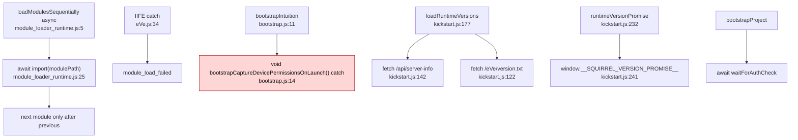

# Async Graph - boot

```mermaid
flowchart TD
  Loader["loadModulesSequentially async\nmodule_loader_runtime.js:5"] --> Import["await import(modulePath)\nmodule_loader_runtime.js:25"]
  Import --> Next["next module only after previous"]
  EveCatch["IIFE catch\neVe.js:34"] --> Fail["module_load_failed"]
  BootIntuition["bootstrapIntuition\nbootstrap.js:11"] --> VoidPerm["void bootstrapCaptureDevicePermissionsOnLaunch().catch\nbootstrap.js:14"]:::risk
  Versions["loadRuntimeVersions\nkickstart.js:177"] --> ServerInfo["fetch /api/server-info\nkickstart.js:142"]
  Versions --> EveVersion["fetch /eVe/version.txt\nkickstart.js:122"]
  RuntimePromise["runtimeVersionPromise\nkickstart.js:232"] --> WindowPromise["window.__SQUIRREL_VERSION_PROMISE__\nkickstart.js:241"]
  ProjectBoot["bootstrapProject"] --> AuthWait["await waitForAuthCheck"]

  classDef risk fill:#ffd6d6,stroke:#a80000,color:#111
```
