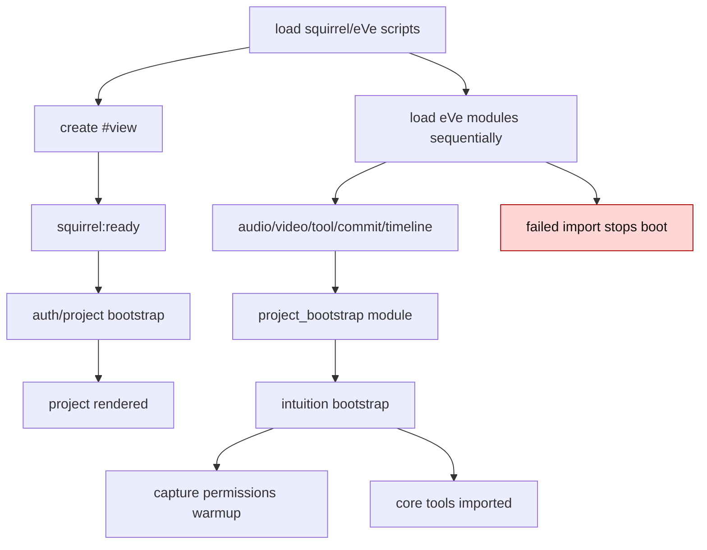

# Lifecycle Graph - boot

```mermaid
flowchart TD
  LoadScripts["load squirrel/eVe scripts"] --> Kickstart["create #view"]
  Kickstart --> Ready["squirrel:ready"]
  LoadScripts --> EveLoader["load eVe modules sequentially"]
  EveLoader --> RuntimeApis["audio/video/tool/commit/timeline"]
  RuntimeApis --> ProjectBoot["project_bootstrap module"]
  ProjectBoot --> Intuition["intuition bootstrap"]
  Intuition --> Permissions["capture permissions warmup"]
  Intuition --> Tools["core tools imported"]
  Ready --> Auth["auth/project bootstrap"]
  Auth --> Project["project rendered"]
  EveLoader --> Failed["failed import stops boot"]:::risk

  classDef risk fill:#ffd6d6,stroke:#a80000,color:#111
```
