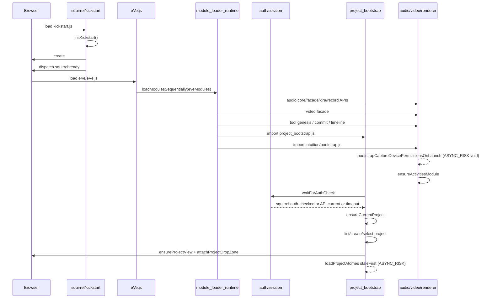

# Boot Timeline - boot

## Chronological load order from `eVe/eVe.js`

1. `eve.play_record_core`
2. `eve.audio_facade`
3. `eve.backend_kira`
4. `eve.record_audio_api`
5. `eve.video_facade`
6. `eve.tool_genesis`
7. `eve.atome_commit`
8. `eve.atome_timeline`
9. `eve.user_background`
10. `eve.languages`
11. `eve.i18n`
12. `eve.design`
13. `eve.voice_assistant`
14. `eve.project_bootstrap`
15. `eve.bootstrap`
16. `eve.shortcut_config`

## Blocking calls

- `await import(modulePath)` for each module in `loadModulesSequentially`.
- `await waitForAuthCheck` before project load.
- `await api.projects.list/create/setCurrent` during project bootstrap.

## Network/disk/runtime access

- `fetch('/api/server-info')` and `fetch('/eVe/version.txt')` in runtime version loading.
- Auth/project APIs through `AdoleAPI`.
- Audio/video permission warmup in `bootstrapIntuition`.

## Lazy-load candidates

- local ONNX TTS preload begins from `eve.voice_assistant` after workspace voice bootstrap
- `eve.user_background`
- `eve.shortcut_config`
- capture/perform/delete/clock/code tools imported by `intuition/bootstrap.js`
- capture permission warmup, if not required before first user gesture
