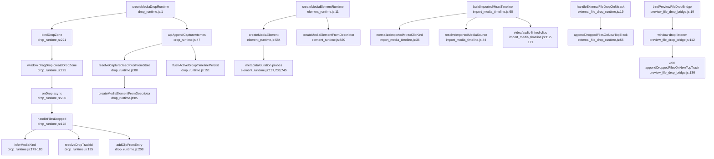

# Call Graph - media-import

```mermaid
flowchart TD
  DropRuntime["createMediaDropRuntime\ndrop_runtime.js:1"] --> BindDrop["bindDropZone\ndrop_runtime.js:221"]
  BindDrop --> DragDrop["window.DragDrop.createDropZone\ndrop_runtime.js:225"]
  DragDrop --> OnDrop["onDrop async\ndrop_runtime.js:230"]
  OnDrop --> HandleFiles["handleFilesDropped\ndrop_runtime.js:178"]
  HandleFiles --> Infer["inferMediaKind\ndrop_runtime.js:179-180"]
  HandleFiles --> Track["resolveDropTrackId\ndrop_runtime.js:195"]
  HandleFiles --> AddClip["addClipFromEntry\ndrop_runtime.js:208"]
  DropRuntime --> CaptureAppend["apiAppendCaptureAtomes\ndrop_runtime.js:47"]
  CaptureAppend --> Descriptor["resolveCaptureDescriptorFromState\ndrop_runtime.js:80"]
  Descriptor --> MediaDescriptor["createMediaElementFromDescriptor\ndrop_runtime.js:85"]
  CaptureAppend --> Persist["flushActiveGroupTimelinePersist\ndrop_runtime.js:151"]

  ElementRuntime["createMediaElementRuntime\nelement_runtime.js:11"] --> CreateElement["createMediaElement\nelement_runtime.js:584"]
  ElementRuntime --> CreateFromDescriptor["createMediaElementFromDescriptor\nelement_runtime.js:830"]
  CreateElement --> Metadata["metadata/duration probes\nelement_runtime.js:197,238,745"]

  ImportTimeline["buildImportedMtraxTimeline\nimport_media_timeline.js:60"] --> NormalizeKind["normalizeImportedMtraxClipKind\nimport_media_timeline.js:36"]
  ImportTimeline --> ResolveSource["resolveImportedMediaSource\nimport_media_timeline.js:44"]
  ImportTimeline --> Clips["video/audio linked clips\nimport_media_timeline.js:112-171"]

  External["handleExternalFileDropOnMtrack\nexternal_file_drop_runtime.js:19"] --> AppendTop["appendDroppedFilesOnNewTopTrack\nexternal_file_drop_runtime.js:55"]
  Preview["bindPreviewFileDropBridge\npreview_file_drop_bridge.js:19"] --> PreviewDrop["window drop listener\npreview_file_drop_bridge.js:112"]
  PreviewDrop --> AppendTopVoid["void appendDroppedFilesOnNewTopTrack\npreview_file_drop_bridge.js:136"]
```
