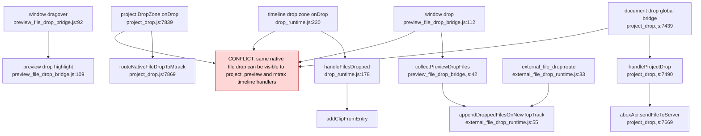

# Event Graph - media-import

```mermaid
flowchart TD
  TimelineDrop["timeline drop zone onDrop\ndrop_runtime.js:230"] --> FilesDropped["handleFilesDropped\ndrop_runtime.js:178"]
  PreviewDrag["window dragover\npreview_file_drop_bridge.js:92"] --> PreviewHighlight["preview drop highlight\npreview_file_drop_bridge.js:109"]
  PreviewDrop["window drop\npreview_file_drop_bridge.js:112"] --> PreviewFiles["collectPreviewDropFiles\npreview_file_drop_bridge.js:42"]
  ProjectGlobal["document drop global bridge\nproject_drop.js:7439"] --> ProjectHandle["handleProjectDrop\nproject_drop.js:7490"]
  ProjectZone["project DropZone onDrop\nproject_drop.js:7839"] --> MtrackRoute["routeNativeFileDropToMtrack\nproject_drop.js:7869"]
  ExternalRoute["external_file_drop:route\nexternal_file_drop_runtime.js:33"] --> AppendTop["appendDroppedFilesOnNewTopTrack\nexternal_file_drop_runtime.js:55"]

  FilesDropped --> AddClip["addClipFromEntry"]
  PreviewFiles --> AppendTop
  ProjectHandle --> Upload["aboxApi.sendFileToServer\nproject_drop.js:7669"]

  Conflict["CONFLICT: same native file drop can be visible to project, preview and mtrax timeline handlers"]:::risk
  TimelineDrop --> Conflict
  PreviewDrop --> Conflict
  ProjectGlobal --> Conflict
  ProjectZone --> Conflict

  classDef risk fill:#ffd6d6,stroke:#a80000,color:#111
```
