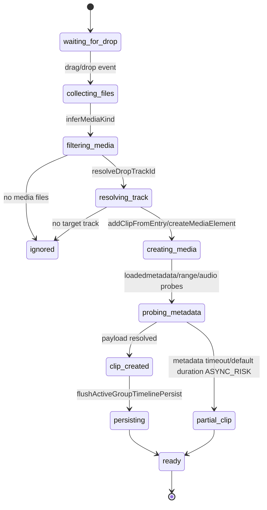

# State Graph - media-import

```mermaid
stateDiagram-v2
  [*] --> waiting_for_drop
  waiting_for_drop --> collecting_files: drag/drop event
  collecting_files --> filtering_media: inferMediaKind
  filtering_media --> ignored: no media files
  filtering_media --> resolving_track: resolveDropTrackId
  resolving_track --> ignored: no target track
  resolving_track --> creating_media: addClipFromEntry/createMediaElement
  creating_media --> probing_metadata: loadedmetadata/range/audio probes
  probing_metadata --> clip_created: payload resolved
  probing_metadata --> partial_clip: metadata timeout/default duration ASYNC_RISK
  clip_created --> persisting: flushActiveGroupTimelinePersist
  persisting --> ready
  partial_clip --> ready
  ready --> [*]
```
