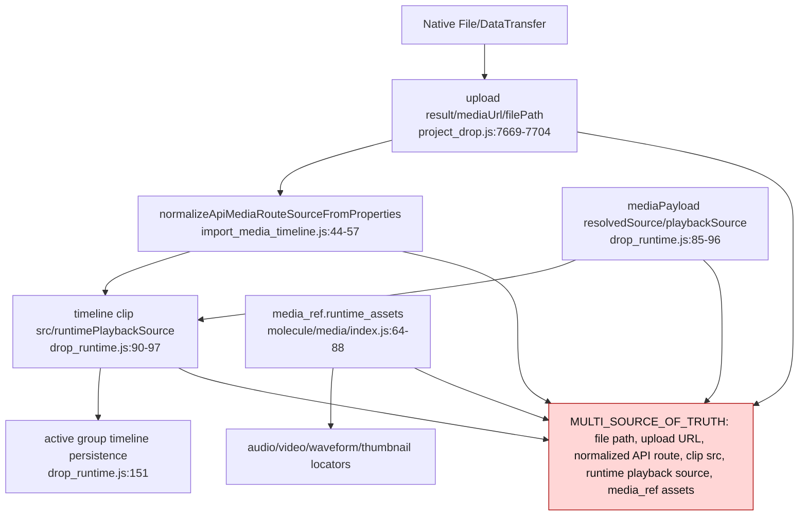

# Source-of-Truth Graph - media-import

```mermaid
flowchart TD
  NativeFile["Native File/DataTransfer"] --> UploadResult["upload result/mediaUrl/filePath\nproject_drop.js:7669-7704"]
  UploadResult --> NormalizedSource["normalizeApiMediaRouteSourceFromProperties\nimport_media_timeline.js:44-57"]
  NormalizedSource --> TimelineClip["timeline clip src/runtimePlaybackSource\ndrop_runtime.js:90-97"]
  ElementPayload["mediaPayload resolvedSource/playbackSource\ndrop_runtime.js:85-96"] --> TimelineClip
  MediaRef["media_ref.runtime_assets\nmolecule/media/index.js:64-88"] --> PlaybackRoute["audio/video/waveform/thumbnail locators"]
  TimelineClip --> PersistedTimeline["active group timeline persistence\ndrop_runtime.js:151"]

  Multi["MULTI_SOURCE_OF_TRUTH: file path, upload URL, normalized API route, clip src, runtime playback source, media_ref assets"]:::risk
  UploadResult --> Multi
  NormalizedSource --> Multi
  ElementPayload --> Multi
  MediaRef --> Multi
  TimelineClip --> Multi

  classDef risk fill:#ffd6d6,stroke:#a80000,color:#111
```
