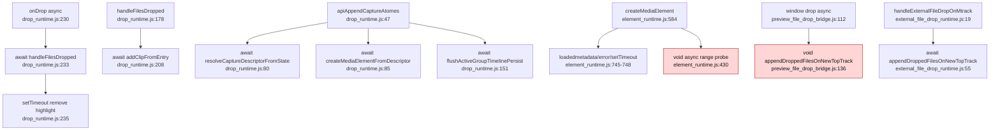

# Async Graph - media-import

```mermaid
flowchart TD
  OnDrop["onDrop async\ndrop_runtime.js:230"] --> AwaitHandle["await handleFilesDropped\ndrop_runtime.js:233"]
  AwaitHandle --> TimerClear["setTimeout remove highlight\ndrop_runtime.js:235"]
  HandleFiles["handleFilesDropped\ndrop_runtime.js:178"] --> AwaitAdd["await addClipFromEntry\ndrop_runtime.js:208"]
  CaptureAppend["apiAppendCaptureAtomes\ndrop_runtime.js:47"] --> AwaitDescriptor["await resolveCaptureDescriptorFromState\ndrop_runtime.js:80"]
  CaptureAppend --> AwaitPayload["await createMediaElementFromDescriptor\ndrop_runtime.js:85"]
  CaptureAppend --> AwaitPersist["await flushActiveGroupTimelinePersist\ndrop_runtime.js:151"]

  Element["createMediaElement\nelement_runtime.js:584"] --> MetadataTimeout["loadedmetadata/error/setTimeout\nelement_runtime.js:745-748"]
  Element --> RangeProbe["void async range probe\nelement_runtime.js:430"]:::risk
  PreviewDrop["window drop async\npreview_file_drop_bridge.js:112"] --> VoidAppend["void appendDroppedFilesOnNewTopTrack\npreview_file_drop_bridge.js:136"]:::risk
  ExternalDrop["handleExternalFileDropOnMtrack\nexternal_file_drop_runtime.js:19"] --> AwaitAppend["await appendDroppedFilesOnNewTopTrack\nexternal_file_drop_runtime.js:55"]

  classDef risk fill:#ffd6d6,stroke:#a80000,color:#111
```
