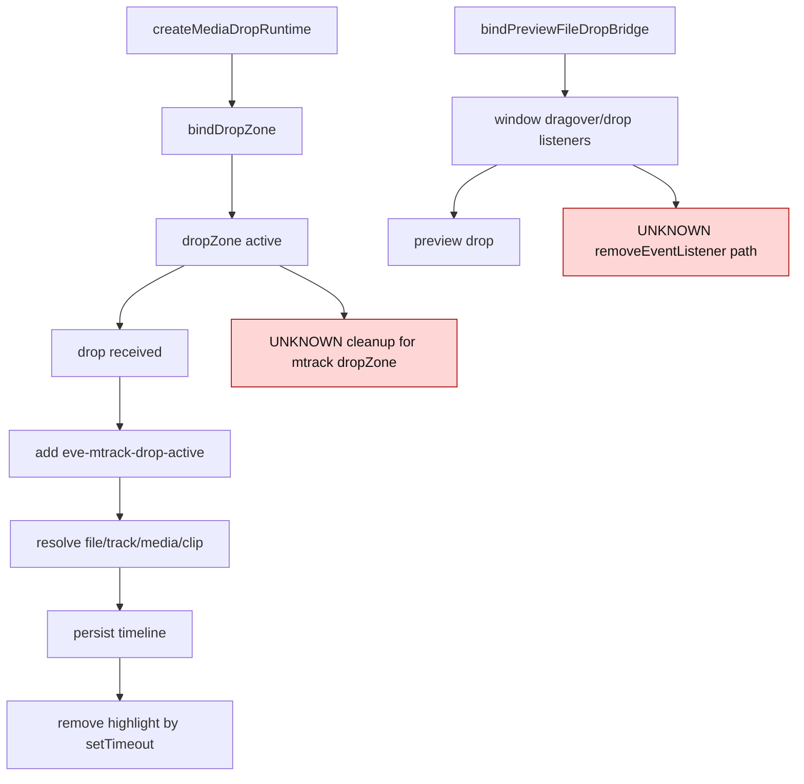

# Lifecycle Graph - media-import

```mermaid
flowchart TD
  Init["createMediaDropRuntime"] --> Bind["bindDropZone"]
  Bind --> Active["dropZone active"]
  Active --> Drop["drop received"]
  Drop --> Highlight["add eve-mtrack-drop-active"]
  Highlight --> Import["resolve file/track/media/clip"]
  Import --> Persist["persist timeline"]
  Persist --> Clear["remove highlight by setTimeout"]
  Active --> DestroyUnknown["UNKNOWN cleanup for mtrack dropZone"]:::risk

  PreviewBind["bindPreviewFileDropBridge"] --> WindowListeners["window dragover/drop listeners"]
  WindowListeners --> PreviewDrop["preview drop"]
  WindowListeners --> PreviewCleanupUnknown["UNKNOWN removeEventListener path"]:::risk

  classDef risk fill:#ffd6d6,stroke:#a80000,color:#111
```
