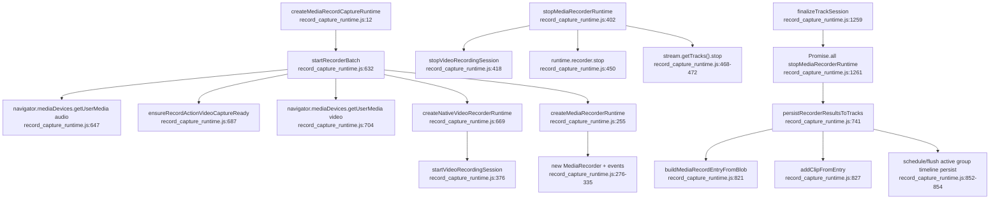

# Call Graph - media-recording

```mermaid
flowchart TD
  Runtime["createMediaRecordCaptureRuntime\nrecord_capture_runtime.js:12"] --> Batch["startRecorderBatch\nrecord_capture_runtime.js:632"]
  Batch --> AudioGUM["navigator.mediaDevices.getUserMedia audio\nrecord_capture_runtime.js:647"]
  Batch --> VideoReady["ensureRecordActionVideoCaptureReady\nrecord_capture_runtime.js:687"]
  Batch --> VideoGUM["navigator.mediaDevices.getUserMedia video\nrecord_capture_runtime.js:704"]
  Batch --> NativeVideo["createNativeVideoRecorderRuntime\nrecord_capture_runtime.js:669"]
  Batch --> Recorder["createMediaRecorderRuntime\nrecord_capture_runtime.js:255"]
  Recorder --> MediaRecorder["new MediaRecorder + events\nrecord_capture_runtime.js:276-335"]
  NativeVideo --> StartNative["startVideoRecordingSession\nrecord_capture_runtime.js:376"]
  Stop["stopMediaRecorderRuntime\nrecord_capture_runtime.js:402"] --> StopNative["stopVideoRecordingSession\nrecord_capture_runtime.js:418"]
  Stop --> StopBrowser["runtime.recorder.stop\nrecord_capture_runtime.js:450"]
  Stop --> StopTracks["stream.getTracks().stop\nrecord_capture_runtime.js:468-472"]
  Finalize["finalizeTrackSession\nrecord_capture_runtime.js:1259"] --> StopAll["Promise.all stopMediaRecorderRuntime\nrecord_capture_runtime.js:1261"]
  StopAll --> Persist["persistRecorderResultsToTracks\nrecord_capture_runtime.js:741"]
  Persist --> BlobEntry["buildMediaRecordEntryFromBlob\nrecord_capture_runtime.js:821"]
  Persist --> AddClip["addClipFromEntry\nrecord_capture_runtime.js:827"]
  Persist --> Flush["schedule/flush active group timeline persist\nrecord_capture_runtime.js:852-854"]
```
