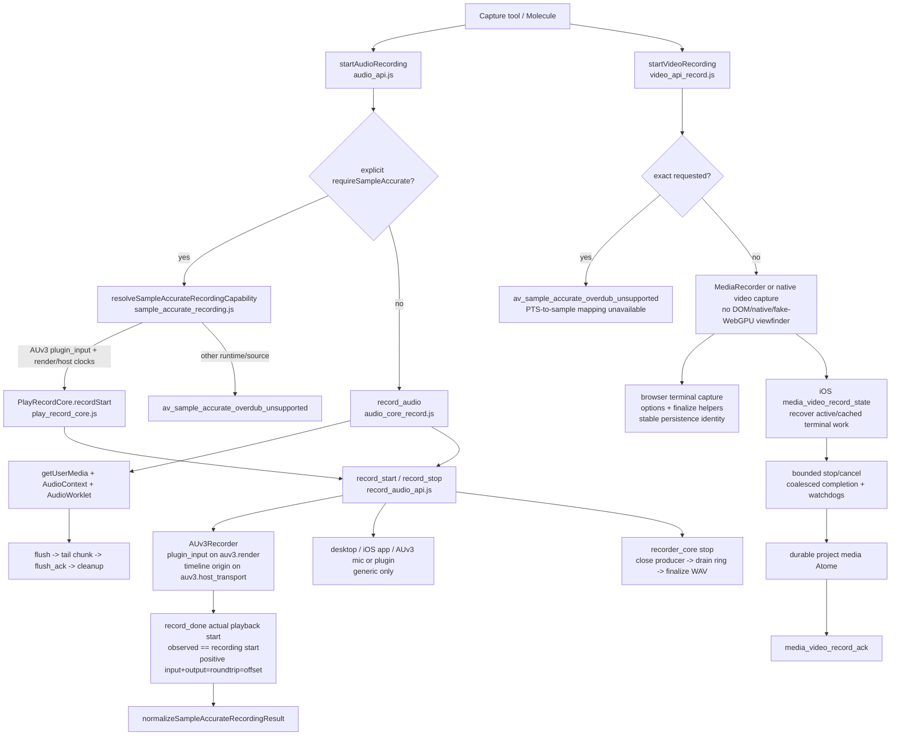

# Call Graph - media-recording

```mermaid
flowchart TD
  Tool["Capture tool / Molecule"] --> AudioAPI["startAudioRecording\naudio_api.js"]
  Tool --> VideoAPI["startVideoRecording\nvideo_api_record.js"]

  AudioAPI --> ExactGate{"explicit requireSampleAccurate?"}
  ExactGate -->|yes| Capability["resolveSampleAccurateRecordingCapability\nsample_accurate_recording.js"]
  Capability -->|AUv3 plugin_input + render/host clocks| Core["PlayRecordCore.recordStart\nplay_record_core.js"]
  Capability -->|other runtime/source| ExactReject["av_sample_accurate_overdub_unsupported"]
  ExactGate -->|no| RecordAudio["record_audio\naudio_core_record.js"]

  RecordAudio --> Browser["getUserMedia + AudioContext + AudioWorklet"]
  RecordAudio --> Native["record_start / record_stop\nrecord_audio_api.js"]
  Core --> Native
  Native --> Auv3["AUv3Recorder\nplugin_input on auv3.render\ntimeline origin on auv3.host_transport"]
  Native --> GenericNative["desktop / iOS app / AUv3 mic or plugin\ngeneric only"]

  Browser --> BrowserStop["flush -> tail chunk -> flush_ack -> cleanup"]
  Native --> NativeCore["recorder_core stop\nclose producer -> drain ring -> finalize WAV"]
  Auv3 --> ExactResult["record_done actual playback start\nobserved == recording start\npositive input+output=roundtrip=offset"]
  ExactResult --> Normalize["normalizeSampleAccurateRecordingResult"]

  VideoAPI --> VideoExact{"exact requested?"}
  VideoExact -->|yes| VideoReject["av_sample_accurate_overdub_unsupported\nPTS-to-sample mapping unavailable"]
  VideoExact -->|no| VideoGeneric["MediaRecorder or native video capture\nno DOM/native/fake-WebGPU viewfinder"]
  VideoGeneric --> BrowserVideo["browser terminal capture\noptions + finalize helpers\nstable persistence identity"]
  VideoGeneric --> NativeVideoState["iOS media_video_record_state\nrecover active/cached terminal work"]
  NativeVideoState --> NativeVideoStop["bounded stop/cancel\ncoalesced completion + watchdogs"]
  NativeVideoStop --> ProjectAtome["durable project media Atome"]
  ProjectAtome --> NativeAck["media_video_record_ack"]
```
