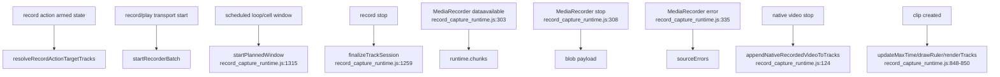

# Event Graph - media-recording

```mermaid
flowchart TD
  RecordArm["record action armed state"] --> TargetTracks["resolveRecordActionTargetTracks"]
  TransportStart["record/play transport start"] --> Batch["startRecorderBatch"]
  LoopWindow["scheduled loop/cell window"] --> StartPlanned["startPlannedWindow\nrecord_capture_runtime.js:1315"]
  TransportStop["record stop"] --> Finalize["finalizeTrackSession\nrecord_capture_runtime.js:1259"]
  RecorderData["MediaRecorder dataavailable\nrecord_capture_runtime.js:303"] --> RuntimeChunks["runtime.chunks"]
  RecorderStop["MediaRecorder stop\nrecord_capture_runtime.js:308"] --> FinalizePayload["blob payload"]
  RecorderError["MediaRecorder error\nrecord_capture_runtime.js:335"] --> ErrorPayload["sourceErrors"]
  NativeStop["native video stop"] --> NativeAppend["appendNativeRecordedVideoToTracks\nrecord_capture_runtime.js:124"]
  PersistedClip["clip created"] --> Render["updateMaxTime/drawRuler/renderTracks\nrecord_capture_runtime.js:848-850"]
```
