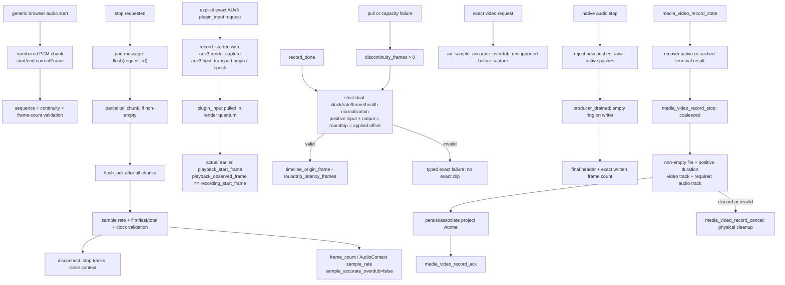

# Event Graph - media-recording

```mermaid
flowchart TD
  BrowserStart["generic browser audio start"] --> WorkletChunk["numbered PCM chunk\nstart/end currentFrame"]
  WorkletChunk --> ValidateChunk["sequence + continuity + frame-count validation"]
  BrowserStop["stop requested"] --> Flush["port message: flush(request_id)"]
  Flush --> Tail["partial tail chunk, if non-empty"]
  Tail --> Ack["flush_ack after all chunks"]
  Ack --> ValidateAck["sample rate + first/last/total + clock validation"]
  ValidateAck --> Cleanup["disconnect, stop tracks, close context"]
  ValidateAck --> BrowserResult["frame_count / AudioContext sample_rate\nsample_accurate_overdub=false"]

  ExactStart["explicit exact AUv3 plugin_input request"] --> Started["record_started with auv3.render capture\nauv3.host_transport origin / epoch"]
  Started --> Quantum["plugin_input pulled in render quantum"]
  Quantum --> NativeFrames["actual earlier playback_start_frame\nplayback_observed_frame == recording_start_frame"]
  PullFailure["pull or capacity failure"] --> Discontinuity["discontinuity_frames > 0"]
  NativeStop["record_done"] --> ExactValidation["strict dual-clock/rate/frame/health normalization\npositive input + output = roundtrip = applied offset"]
  Discontinuity --> ExactValidation
  ExactValidation -->|valid| TimelinePlacement["timeline_origin_frame - roundtrip_latency_frames"]
  ExactValidation -->|invalid| ExactFailure["typed exact failure; no exact clip"]

  VideoExact["exact video request"] --> VideoReject["av_sample_accurate_overdub_unsupported before capture"]

  NativeAudioStop["native audio stop"] --> CloseProducer["reject new pushes; await active pushes"]
  CloseProducer --> DrainWriter["producer_drained; empty ring on writer"]
  DrainWriter --> FinalWav["final header + exact written frame count"]

  NativeVideoState["media_video_record_state"] --> RecoverVideo["recover active or cached terminal result"]
  RecoverVideo --> VideoStop["media_video_record_stop; coalesced"]
  VideoStop --> VideoValidate["non-empty file + positive duration\nvideo track + required audio track"]
  VideoValidate --> ProjectCommit["persist/associate project Atome"]
  ProjectCommit --> VideoAck["media_video_record_ack"]
  VideoValidate -->|discard or invalid| VideoCancel["media_video_record_cancel; physical cleanup"]
```
