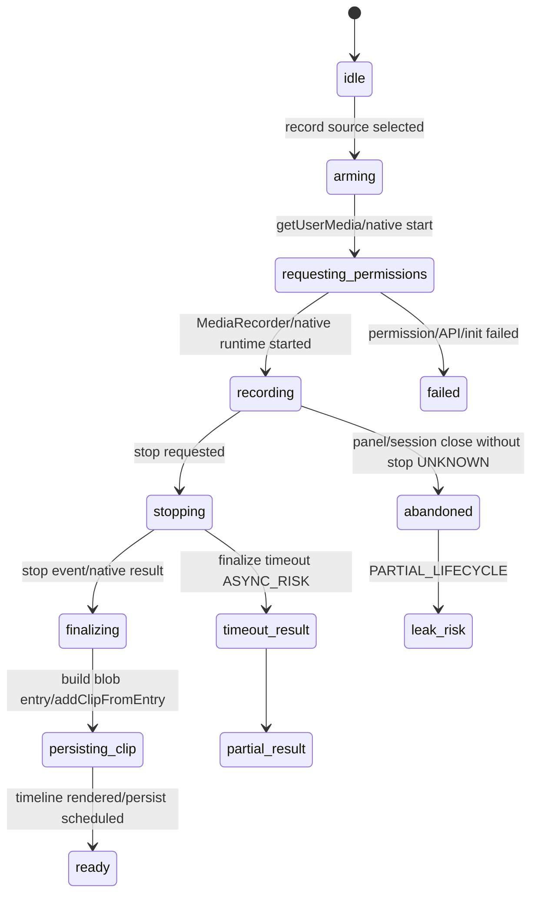

# State Graph - media-recording

```mermaid
stateDiagram-v2
  [*] --> idle
  idle --> arming: record source selected
  arming --> requesting_permissions: getUserMedia/native start
  requesting_permissions --> recording: MediaRecorder/native runtime started
  requesting_permissions --> failed: permission/API/init failed
  recording --> stopping: stop requested
  stopping --> finalizing: stop event/native result
  finalizing --> persisting_clip: build blob entry/addClipFromEntry
  persisting_clip --> ready: timeline rendered/persist scheduled
  stopping --> timeout_result: finalize timeout ASYNC_RISK
  timeout_result --> partial_result
  recording --> abandoned: panel/session close without stop UNKNOWN
  abandoned --> leak_risk: PARTIAL_LIFECYCLE
```
