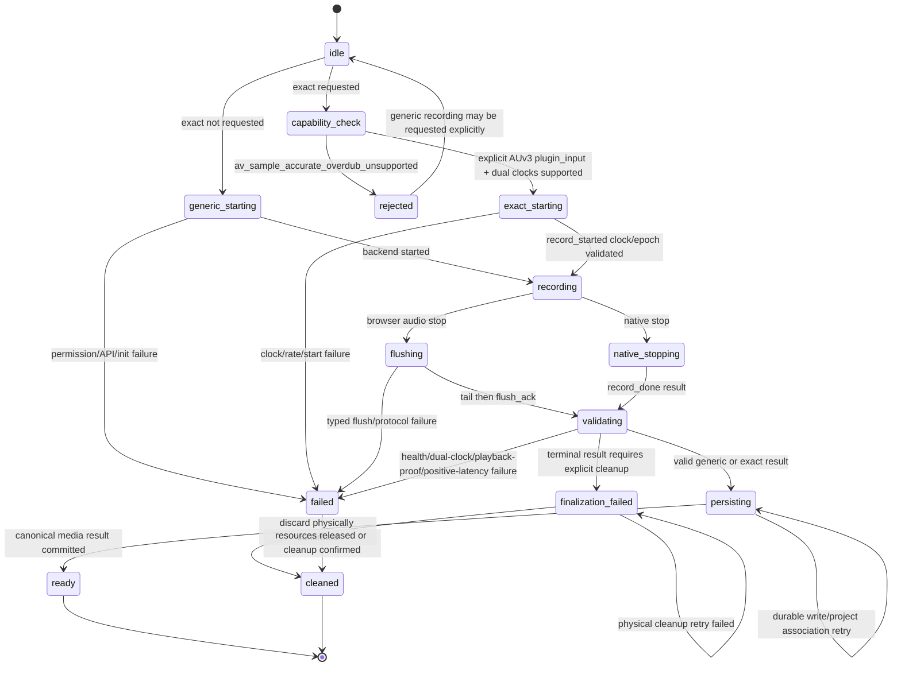

# State Graph - media-recording

Native iOS video adds a serialized host-owned lifecycle around these states. A WebView
reload first calls `media_video_record_state`; `starting`, `recording`, `stopping`, and an
unacknowledged successful terminal result are recoverable. Start and stop delegate waits
are bounded by watchdogs, concurrent stops share one completion, and a successful result
remains cached until durable project association is followed by `media_video_record_ack`.
A cleanup failure reports `terminal: false` and blocks a new start until cancel/cleanup
succeeds.
