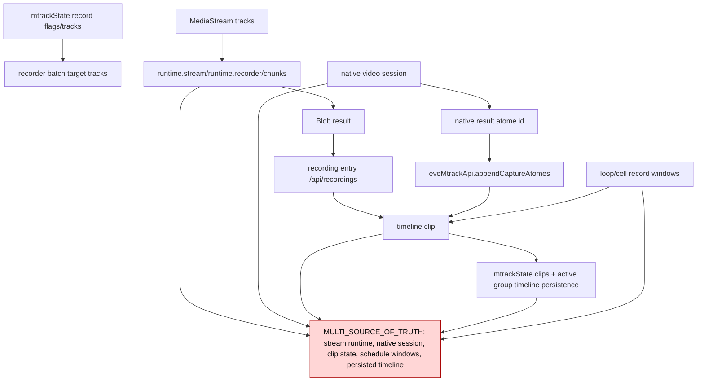

# Source-of-Truth Graph - media-recording

```mermaid
flowchart TD
  State["mtrackState record flags/tracks"] --> Batch["recorder batch target tracks"]
  MediaStream["MediaStream tracks"] --> RecorderRuntime["runtime.stream/runtime.recorder/chunks"]
  NativeSession["native video session"] --> NativeResult["native result atome id"]
  RecorderRuntime --> Blob["Blob result"]
  Blob --> RecordEntry["recording entry /api/recordings"]
  NativeResult --> AppendAtome["eveMtrackApi.appendCaptureAtomes"]
  RecordEntry --> Clip["timeline clip"]
  AppendAtome --> Clip
  Clip --> Timeline["mtrackState.clips + active group timeline persistence"]
  LoopSchedule["loop/cell record windows"] --> Clip

  Multi["MULTI_SOURCE_OF_TRUTH: stream runtime, native session, clip state, schedule windows, persisted timeline"]:::risk
  RecorderRuntime --> Multi
  NativeSession --> Multi
  Clip --> Multi
  Timeline --> Multi
  LoopSchedule --> Multi

  classDef risk fill:#ffd6d6,stroke:#a80000,color:#111
```
