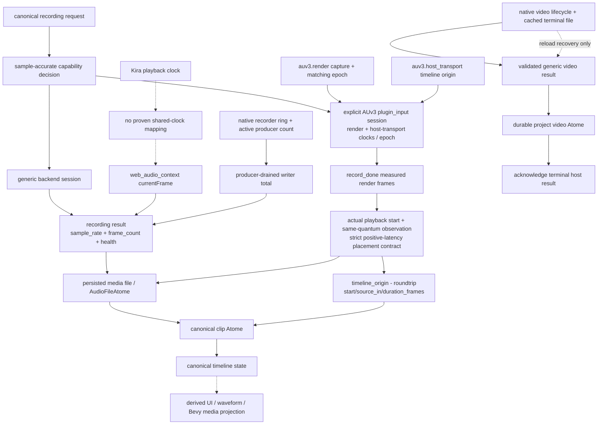

# Source-of-Truth Graph - media-recording

The native terminal cache is recoverable runtime state, not canonical project truth. The
persisted media Atome becomes the durable owner; acknowledgement is permitted only after
that commit succeeds. Browser retry similarly reuses one stable recording Atome/upload
identity instead of producing a second durable object.
