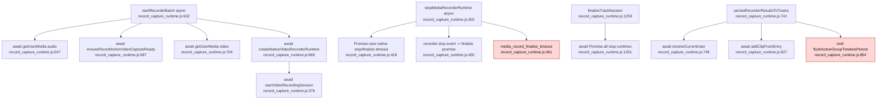

# Async Graph - media-recording

```mermaid
flowchart TD
  Batch["startRecorderBatch async\nrecord_capture_runtime.js:632"] --> Audio["await getUserMedia audio\nrecord_capture_runtime.js:647"]
  Batch --> VideoReady["await ensureRecordActionVideoCaptureReady\nrecord_capture_runtime.js:687"]
  Batch --> Video["await getUserMedia video\nrecord_capture_runtime.js:704"]
  Batch --> Native["await createNativeVideoRecorderRuntime\nrecord_capture_runtime.js:669"]
  Native --> StartNative["await startVideoRecordingSession\nrecord_capture_runtime.js:376"]
  Stop["stopMediaRecorderRuntime async\nrecord_capture_runtime.js:402"] --> Race["Promise.race native stop/finalize timeout\nrecord_capture_runtime.js:418"]
  Stop --> BrowserStop["recorder.stop event -> finalize promise\nrecord_capture_runtime.js:450"]
  Stop --> Timeout["media_record_finalize_timeout\nrecord_capture_runtime.js:461"]:::risk
  Finalize["finalizeTrackSession\nrecord_capture_runtime.js:1259"] --> StopAll["await Promise.all stop runtimes\nrecord_capture_runtime.js:1261"]
  Persist["persistRecorderResultsToTracks\nrecord_capture_runtime.js:741"] --> User["await resolveCurrentUser\nrecord_capture_runtime.js:748"]
  Persist --> Add["await addClipFromEntry\nrecord_capture_runtime.js:827"]
  Persist --> VoidFlush["void flushActiveGroupTimelinePersist\nrecord_capture_runtime.js:854"]:::risk

  classDef risk fill:#ffd6d6,stroke:#a80000,color:#111
```
