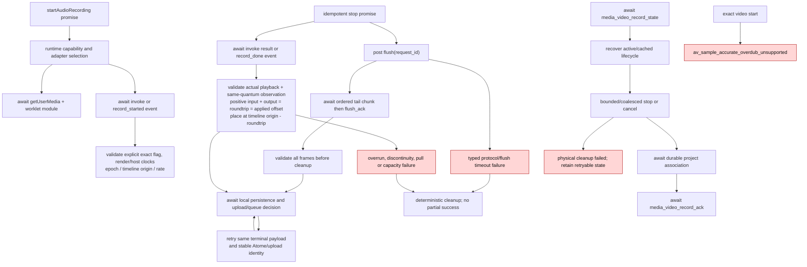

# Async Graph - media-recording

```mermaid
flowchart TD
  Start["startAudioRecording promise"] --> Runtime["runtime capability and adapter selection"]
  Runtime --> BrowserOpen["await getUserMedia + worklet module"]
  Runtime --> NativeStart["await invoke or record_started event"]
  NativeStart --> ExactStartValidation["validate explicit exact flag, render/host clocks\nepoch / timeline origin / rate"]

  Stop["idempotent stop promise"] --> BrowserFlush["post flush(request_id)"]
  BrowserFlush --> OrderedMessages["await ordered tail chunk then flush_ack"]
  OrderedMessages --> BrowserValidate["validate all frames before cleanup"]
  BrowserFlush --> FlushFailure["typed protocol/flush timeout failure"]:::failure

  Stop --> NativeStop["await invoke result or record_done event"]
  NativeStop --> ExactNormalize["validate actual playback + same-quantum observation\npositive input + output = roundtrip = applied offset\nplace at timeline origin - roundtrip"]
  ExactNormalize --> DiscontinuityFailure["overrun, discontinuity, pull or capacity failure"]:::failure

  BrowserValidate --> Persist["await local persistence and upload/queue decision"]
  ExactNormalize --> Persist
  Persist --> PersistRetry["retry same terminal payload\nand stable Atome/upload identity"]
  PersistRetry --> Persist
  FlushFailure --> Cleanup["deterministic cleanup; no partial success"]
  DiscontinuityFailure --> Cleanup

  NativeVideoOpen["await media_video_record_state"] --> NativeVideoRecover["recover active/cached lifecycle"]
  NativeVideoRecover --> NativeVideoStop["bounded/coalesced stop or cancel"]
  NativeVideoStop --> NativeVideoCommit["await durable project association"]
  NativeVideoCommit --> NativeVideoAck["await media_video_record_ack"]
  NativeVideoStop --> CleanupRetry["physical cleanup failed; retain retryable state"]:::failure

  VideoExact["exact video start"] --> ImmediateReject["av_sample_accurate_overdub_unsupported"]:::failure

  classDef failure fill:#ffd6d6,stroke:#a80000,color:#111
```
