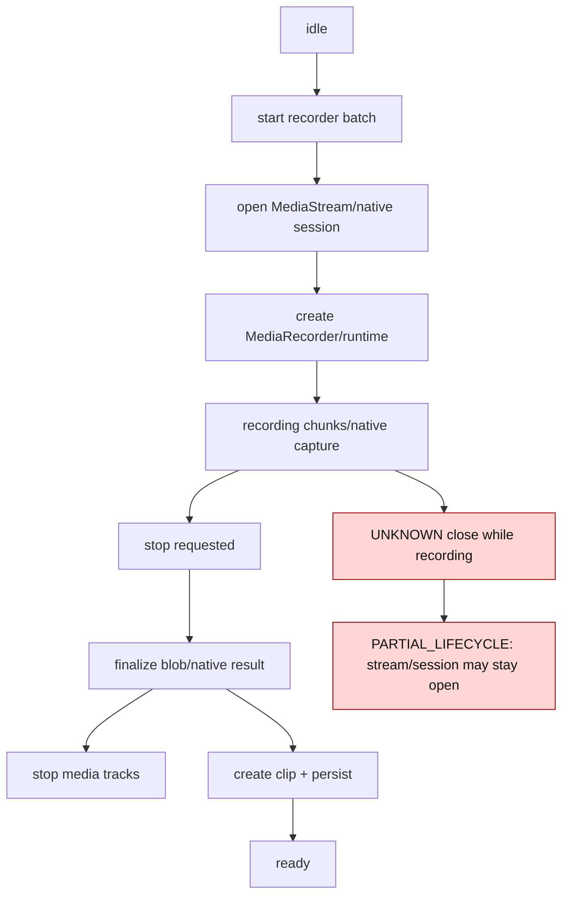

# Lifecycle Graph - media-recording

```mermaid
flowchart TD
  Idle["idle"] --> Start["start recorder batch"]
  Start --> Streams["open MediaStream/native session"]
  Streams --> Recorder["create MediaRecorder/runtime"]
  Recorder --> Recording["recording chunks/native capture"]
  Recording --> Stop["stop requested"]
  Stop --> Finalize["finalize blob/native result"]
  Finalize --> StopTracks["stop media tracks"]
  Finalize --> Persist["create clip + persist"]
  Persist --> Ready["ready"]
  Recording --> CloseUnknown["UNKNOWN close while recording"]:::risk
  CloseUnknown --> Leak["PARTIAL_LIFECYCLE: stream/session may stay open"]:::risk

  classDef risk fill:#ffd6d6,stroke:#a80000,color:#111
```
