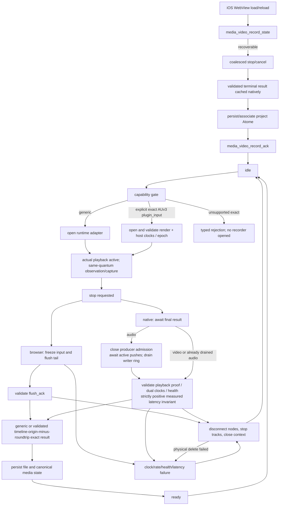

# Lifecycle Graph - media-recording

```mermaid
flowchart TD
  Idle["idle"] --> Gate["capability gate"]
  Gate -->|generic| Opening["open runtime adapter"]
  Gate -->|explicit exact AUv3 plugin_input| ExactOpening["open and validate render + host clocks / epoch"]
  Gate -->|unsupported exact| Rejected["typed rejection; no recorder opened"]
  Opening --> Recording["generic recording"]
  ExactOpening --> Recording["actual playback active; same-quantum observation/capture"]
  Recording --> Stop["stop requested"]

  Stop --> BrowserFlush["browser: freeze input and flush tail"]
  BrowserFlush --> BrowserAck["validate flush_ack"]
  Stop --> NativeDone["native: await final result"]
  NativeDone -->|audio| ProducerDrain["close producer admission\nawait active pushes; drain writer ring"]
  ProducerDrain --> Health["validate playback proof / dual clocks / health\nstrictly positive measured latency invariant"]
  NativeDone -->|video or already drained audio| Health

  BrowserAck --> Cleanup["disconnect nodes, stop tracks, close context"]
  Health --> Cleanup
  BrowserAck --> Result["generic result"]
  Health --> Result["generic or validated timeline-origin-minus-roundtrip exact result"]
  Result --> Persist["persist file and canonical media state"]
  Persist --> Ready["ready"]

  BrowserFlush --> Failure["typed failure"]
  Health --> Failure["clock/rate/health/latency failure"]
  Failure --> Cleanup
  Cleanup -->|physical delete failed| Failure
  Cleanup --> Idle
  Ready --> Idle

  VideoReload["iOS WebView load/reload"] --> VideoState["media_video_record_state"]
  VideoState -->|recoverable| VideoStop["coalesced stop/cancel"]
  VideoStop --> VideoTerminal["validated terminal result cached natively"]
  VideoTerminal --> VideoPersist["persist/associate project Atome"]
  VideoPersist --> VideoAck["media_video_record_ack"]
  VideoAck --> Idle
```
