# Call Graph - molecule

```mermaid
flowchart TD
  Boot["installMoleculeGroupTimelineRuntime\neVe/intuition/tools/molecule/runtime.js:138"] --> Api["eveMoleculeTimelineApi + registerGroupTimelineApi\neVe/intuition/tools/molecule/runtime.js:226-227"]
  Api --> Open["openGroupTimeline(detail)\neVe/intuition/tools/molecule/runtime.js:149"]
  Open --> Build["buildTimelineFromSteps\neVe/intuition/tools/molecule/runtime.js:101"]
  Build --> KernelCreate["createTimeline/addTrack/addClip\neVe/intuition/tools/molecule/kernel/index.js:8-31"]
  Open --> SaveInitial["projectStore.saveTimeline\neVe/intuition/tools/molecule/runtime.js:163"]
  Open --> Session["createMoleculeSession\neVe/intuition/tools/molecule/session/session.js:118"]
  Session --> Reducers["OPERATION_DISPATCH reducers\neVe/intuition/tools/molecule/session/session.js:35-54"]
  Session --> EventSink["eventSink.append\neVe/intuition/tools/molecule/session/session.js:221"]
  Session --> Commit["onStateCommitted -> projectStore.saveTimeline\neVe/intuition/tools/molecule/runtime.js:167"]
  Open --> Panel["openMoleculePanel\neVe/intuition/tools/molecule/panel/index.js:209"]
  Panel --> RenderTimeline["renderTimeline\neVe/intuition/tools/molecule/panel/index.js:111"]
  Panel --> RenderTools["renderMoleculePanelTools\neVe/intuition/tools/molecule/panel/index.js:48"]
  RenderTools --> FooterApi["footerApi.resolveToolDefinitions / invokeToolDefinition\neVe/intuition/tools/molecule/panel/index.js:61-65"]
  Api --> Close["closeGroupTimeline\neVe/intuition/tools/molecule/runtime.js:196"]
  Close --> ClosePanel["closeMoleculePanel\neVe/intuition/tools/molecule/panel/index.js:202"]
  Close --> Dispose["session.dispose\neVe/intuition/tools/molecule/session/session.js:306"]

  Multi["createMoleculeMultiInstanceController\neVe/intuition/tools/molecule/multi_instance/index.js:24"] --> Registry["createMoleculeSessionRegistry\neVe/intuition/tools/molecule/session/registry.js:18"]
  Multi --> OpenInstance["openInstance\neVe/intuition/tools/molecule/multi_instance/index.js:36"]
  OpenInstance --> RegistryOpen["registry.open\neVe/intuition/tools/molecule/session/registry.js:32"]
  RegistryOpen --> Session
  OpenInstance --> Panel
  OpenInstance --> SaveVoid["void save(session)\neVe/intuition/tools/molecule/multi_instance/index.js:61"]

  Record["createMoleculeRecordingSession\neVe/intuition/tools/molecule/recording/index.js:141"] --> StartCapture["start -> captureEngine.startCapture\neVe/intuition/tools/molecule/recording/index.js:172-203"]
  Record --> Confirm["confirm -> finishCapture/importMedia/applyAndPersist\neVe/intuition/tools/molecule/recording/index.js:219-242"]
  Confirm --> MediaStore["mediaStore.importMedia\neVe/intuition/tools/molecule/recording/index.js:222"]
  Confirm --> Persistence["persistence.applyAndPersist\neVe/intuition/tools/molecule/recording/index.js:242"]

  Media["createMoleculeMediaResolver\neVe/intuition/tools/molecule/media/index.js:53"] --> LoadRef["mediaStore.getMediaRef\neVe/intuition/tools/molecule/media/index.js:64"]
  Media --> ResolvePlayback["resolvePlayback\neVe/intuition/tools/molecule/media/index.js:74"]
  ResolvePlayback --> RuntimeAssets["media_ref.runtime_assets\neVe/intuition/tools/molecule/media/index.js:77-88"]
```

## Notes

- `CONFLICT`: `openGroupTimeline` et `openInstance` peuvent ouvrir des sessions/panneaux pour une timeline sans partager le meme registre.
- `UNKNOWN`: aucune integration directe avec `window.Molecule` n'a ete trouvee dans les fichiers molecule inspectes.
