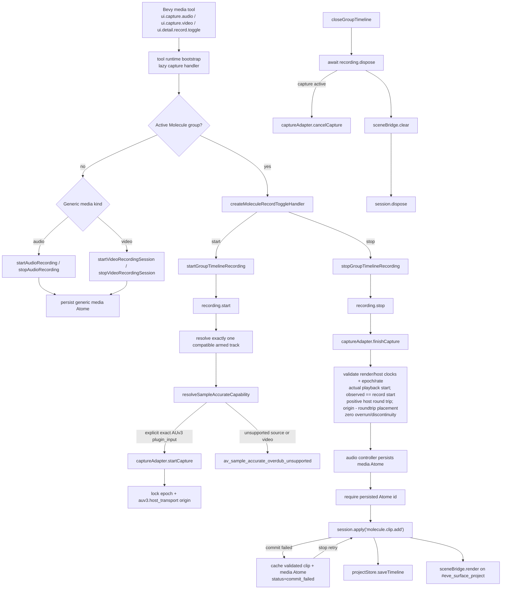

# Call Graph - Molecule Recording

## Notes

- Generic audio/video and exact Molecule overdub share tool entry points but not timing guarantees.
- The exact path has no provisional media object: the persisted Atome id is mandatory before the clip mutation.
- If the clip mutation fails after capture finalization, the coordinator retains the same validated clip and media Atome in `commit_failed`; retrying `stop()` retries only `session.apply` and never finalizes or persists capture twice.
- Exact host compensation proves strictly positive `input_latency_frames + output_latency_frames = roundtrip_latency_frames`, then requires `record_offset_frames_applied` to equal that sum. Placement is `timeline_origin_frame - roundtrip_latency_frames`.
- `playback_start_frame` is the actual earlier backing-track start; `playback_observed_frame == recording_start_frame` proves playback was active in the capture quantum. That playback lead is not applied again to placement.
- `plugin_input` means AUv3 input captured inside the same render quantum. Plug-in output/mix remains a distinct generic source.
- Video takes the generic controller path; the exact branch returns `av_sample_accurate_overdub_unsupported` before capture until audio-sample PTS mapping exists.
- Rendering is a downstream Bevy projection, never a recording-owned DOM `<video>`/``, product canvas, native overlay, or simulated WebGPU viewfinder.
