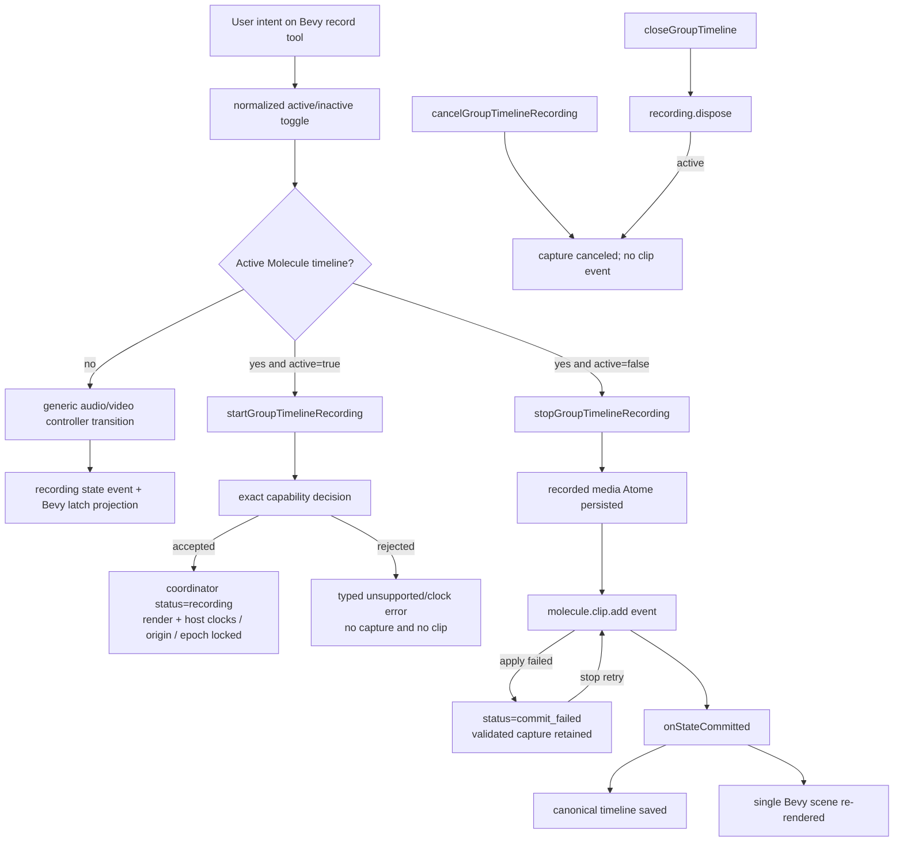

# Event Graph - Molecule Recording

## Event guarantees

- UI latch changes follow controller results; UI events do not define sample positions.
- An exact start emits no timeline mutation.
- The only successful exact timeline mutation is `molecule.clip.add`, after durable media identity exists.
- A failed `molecule.clip.add` application emits no successful timeline mutation. The coordinator retains the immutable finalized clip/media identity and a later stop retries that application only.
- Exact video rejection is the expected `av_sample_accurate_overdub_unsupported` capability result; it does not disable generic video recording or synthesize a live preview.
- Closing the group triggers coordinator disposal even when capture is active.
