# Event Graph - molecule

```mermaid
flowchart TD
  UserIntent["User intent: open group timeline"] --> GroupApi["openGroupTimeline(detail)\nruntime.js:149"]
  GroupApi --> PanelReady["panel rendered\npanel/index.js:231-253"]

  ToolClick["click on molecule tool button\npanel/index.js:40"] --> InvokeTool["footerApi.invokeToolDefinition\npanel/index.js:63"]
  MarkerDblClick["dblclick marker\npanel/index.js:132"] --> MarkerUpsert["session.apply('molecule.marker.upsert')\npanel/index.js:134"]
  TrackToggle["click solo/mute/record_arm\npanel/index.js:153"] --> TrackUpdate["session.apply('molecule.track.update')\npanel/index.js:154-157"]
  SnapChange["change snap select\npanel/index.js:179"] --> SnapApply["session.apply('molecule.transport.snap')\npanel/index.js:180"]
  HistoryKey["keydown cmd/ctrl+z\npanel/index.js:189"] --> UndoRedo["session.undo/session.redo\npanel/index.js:193-197"]
  CloseClick["click molecule-close\npanel/index.js:255"] --> HideOnly["closeMoleculePanel hides panel\npanel/index.js:202-206"]

  RuntimeClose["closeGroupTimeline(groupId)\nruntime.js:196"] --> FullClose["close panel + session.dispose + sessionsByGroup.delete\nruntime.js:204-209"]
  HideOnly --> ConflictClose["CONFLICT: close button does not call closeGroupTimeline"]

  SessionApply["session.apply\nsession.js:205"] --> DurableEvent["eventSink.append\nsession.js:221"]
  SessionApply --> ListenerEmit["emit listeners\nsession.js:245"]
  UndoRedo --> HistoryEvent["molecule.history.undo/redo append\nsession.js:248-297"]
```

## Event risks

- `CONFLICT`: UI close button calls `closeMoleculePanel` only; runtime close calls `closeMoleculePanel`, `session.dispose` and map deletion.
- `CONFLICT`: panel DOM events call `session.apply` directly, while external tool invocations may mutate through `footerApi.invokeToolDefinition`.
- `UNKNOWN`: no event listener named `atome_mtrack_open_request` is present in the molecule files; legacy `mtrax` may still own that route.
