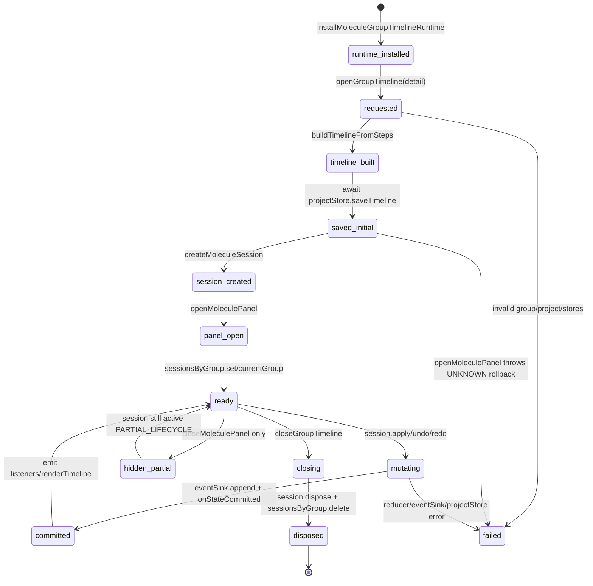

# State Graph - molecule

## State notes

- `RISK`: `hidden_partial` exists because `closeMoleculePanel` only sets `display = 'none'`.
- `UNKNOWN`: no rollback state is implemented in `openGroupTimeline` after initial `projectStore.saveTimeline`.
- `PARTIAL_LIFECYCLE`: listener cleanup happens in `session.dispose`, but close button does not reach dispose.
