# State Graph - Molecule Recording

```mermaid
stateDiagram-v2
  [*] --> idle: coordinator created
  idle --> starting: start(exact request)
  starting --> idle: invalid track/frame/clock or unsupported capability
  starting --> recording: capture id + render/host clocks + origin + locked epoch
  starting --> idle: backend start failure and cleanup
  recording --> stopping: stop()
  stopping --> idle: finish succeeded; timing validated; Atome persisted; clip committed
  stopping --> idle: terminal finish returned but timing/result validation failed
  stopping --> commit_failed: capture validated + Atome persisted; clip commit failed
  commit_failed --> stopping: stop() retries cached clip commit
  commit_failed --> idle: cached clip commit succeeds
  stopping --> recording: backend did not finish; retry remains possible
  recording --> canceling: cancel()
  canceling --> idle: capture released; no clip
  idle --> disposed: dispose()
  starting --> disposed: dispose waits for start settlement and cancels acquisition
  recording --> disposed: dispose cancels active capture
  disposed --> [*]
```

## State invariants

- `read()` exposes status plus active capture, target, clock, epoch, frame origin, sample rate, and capability.
- There is never more than one active capture per coordinator.
- The `clock_epoch` and host-transport `timeline_origin_frame` become immutable when exact start succeeds and must match stop.
- Exact stop requires a real earlier playback start, same-quantum playback observation/recording start, strictly positive latency, and origin-minus-roundtrip placement.
- An exact video request returns `av_sample_accurate_overdub_unsupported` and returns to `idle` before backend capture.
- `disposed` is terminal; subsequent start/stop/cancel operations fail explicitly.
- Generic audio/video controllers have their own controller states and do not acquire exact status merely by returning frame metadata.
- `commit_failed` retains no active backend capture: it retains only the validated clip and durable media identity required to retry the canonical session mutation.
