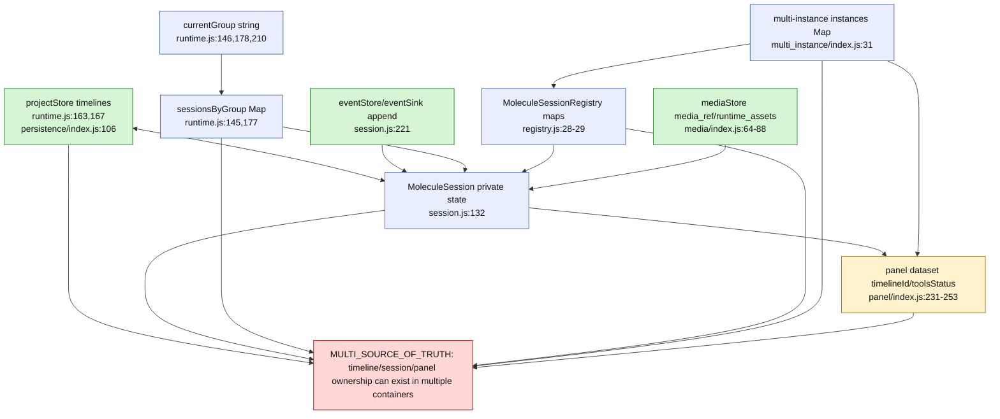

# Source-of-Truth Graph - molecule

## Ownership questions resolved

- State owner during an open session: `MoleculeSession` private `state`.
- Durable timeline snapshot: `projectStore.saveTimeline`.
- Durable mutation log: `eventSink.append`.
- UI reflection: molecule panel DOM, not durable.
- Concurrent copies: `sessionsByGroup`, `registry/byTimeline`, `instances`, panel dataset and project store.
