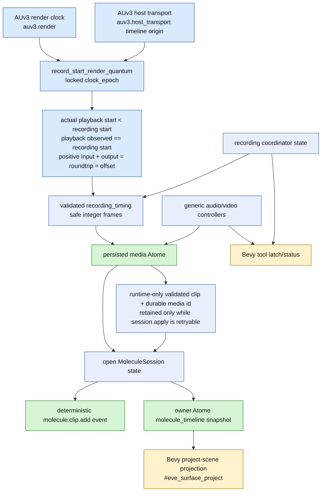

# Source-of-Truth Graph - Molecule Recording

## Ownership

- Exact timing truth combines validated AUv3 `plugin_input` render-clock capture with the host-transport timeline origin, not UI time, wall time, file duration, or DOM state.
- The locked epoch and integer frames are persisted with the clip; seconds are derived from the timeline sample rate.
- Playback truth preserves the actual earlier `playback_start_frame` and proves the recording quantum with `playback_observed_frame == recording_start_frame`.
- Latency truth is strictly positive, host-measured, and additive: `input_latency_frames + output_latency_frames = roundtrip_latency_frames = record_offset_frames_applied`; placement is `timeline_origin_frame - roundtrip_latency_frames`.
- The recorded file becomes durable through the media Atome before the Molecule session can reference it.
- The coordinator may retain an immutable finalized clip/media id only to retry a failed canonical `session.apply`; this runtime cache never replaces the media Atome, event log, or owner snapshot as durable truth.
- The owner Atome snapshot and deterministic event log are the durable timeline authorities.
- The coordinator and session are runtime state; Bevy records and tool latches are disposable projections.
- The DOM is not a product rendering or recording source of truth. Real recorder-owned scope/camera frames may feed the shared Bevy tool overlay, but those bounded frames, their session id, and their phase are disposable renderer state only; no visible DOM/native/fake-WebGPU viewfinder is authoritative.
- Generic plug-in output/mix and video results remain generic even when they have precise-looking metadata.
