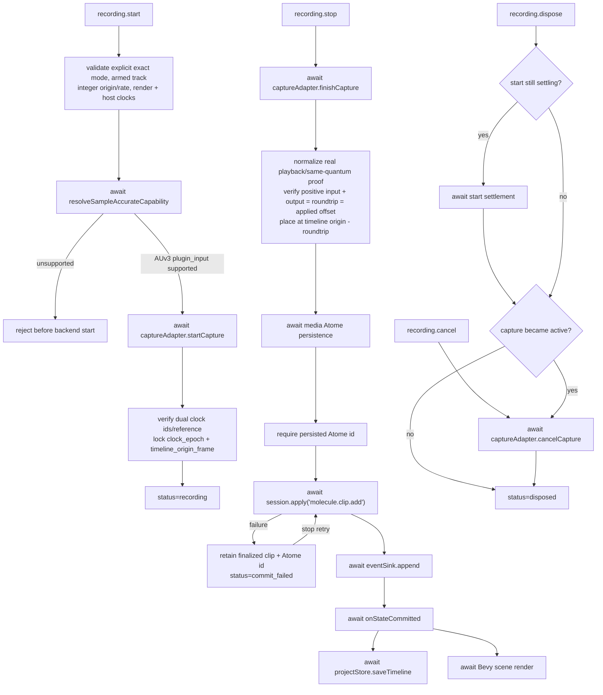

# Async Graph - Molecule Recording

## Async locks

- Capability resolution completes before backend acquisition.
- The start epoch and host-transport origin are locked before the coordinator reports `recording`.
- Exact stop validation runs before the media result can mutate the timeline.
- Media Atome persistence completes before `session.apply` commits the clip.
- Capture finalization, timing normalization, and media persistence run at most once for a take. If `session.apply` fails, retrying stop reuses the cached finalized clip and Atome id.
- Session commit persistence/rendering uses the existing awaited Molecule commit callback.
- Disposal waits for an in-flight start and cannot leave an acquired capture unobserved.
- A generic video operation uses the video controller independently and without a recording viewfinder; exact video returns `av_sample_accurate_overdub_unsupported` at capability resolution and does not enter this stop chain.
