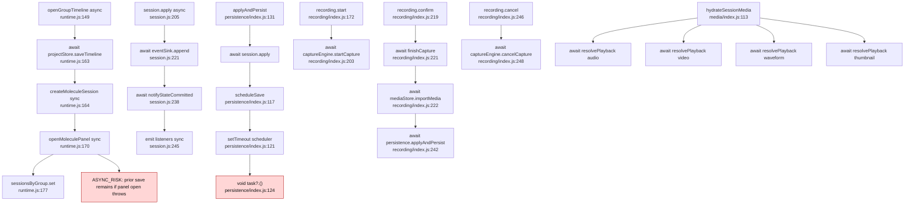

# Async Graph - molecule

## Async risks

- `ASYNC_RISK`: `openGroupTimeline` persists before the panel/session registration is complete; no rollback is proven.
- `ASYNC_RISK`: debounce timer runs `void task?.()`, so save failure can become detached from caller.
- `ASYNC_RISK`: `openInstance` calls `void save(session)` in `multi_instance/index.js:61`.
- `UNKNOWN`: no guard was found for state modified after panel close when the close button hides the DOM only.
