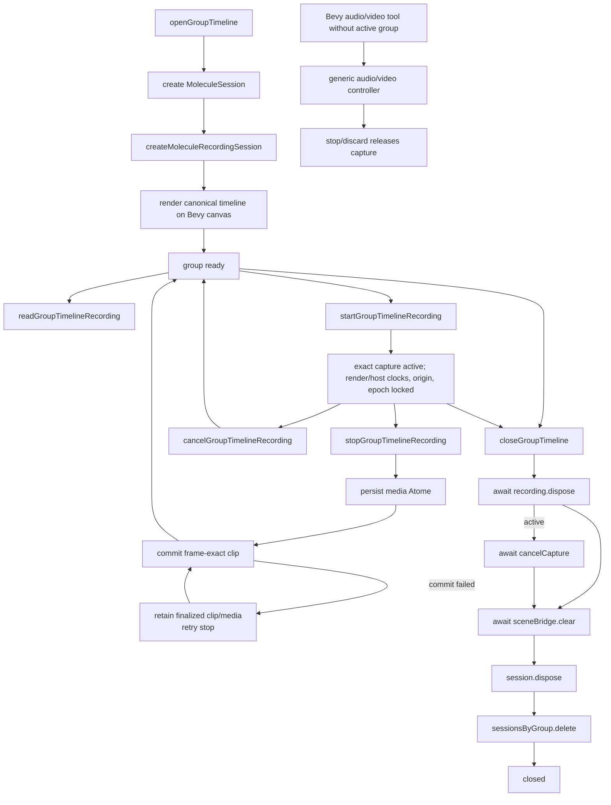

# Lifecycle Graph - Molecule Recording

## Lifecycle findings

- The recording coordinator has an explicit terminal `dispose()` operation.
- Group close awaits recording disposal before clearing the scene or disposing the session.
- Disposal cancels active capture and also handles a start that is still settling.
- Stop creates a clip only after capture has finished, timing has validated, and the media Atome is durable.
- A clip-commit failure after those phases retains the immutable finalized result in `commit_failed`; retry does not touch the capture backend or create another media Atome.
- Cancel/dispose create no clip.
- Generic video remains available outside the exact coordinator; exact video returns `av_sample_accurate_overdub_unsupported` before acquisition until audio-sample PTS mapping exists.
- Recording never owns a second product renderer, DOM `<video>`/``, native overlay, or fake WebGPU preview surface.
