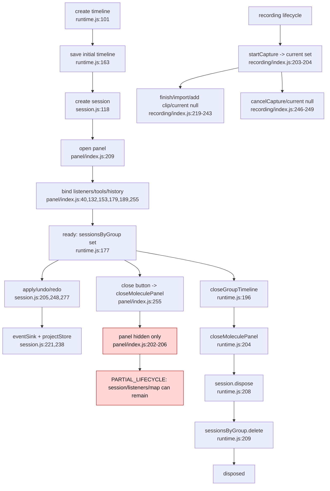

# Lifecycle Graph - molecule

## Lifecycle findings

- `PARTIAL_LIFECYCLE`: `closeMoleculePanel` does not dispose session or unregister `sessionsByGroup`.
- `PARTIAL_LIFECYCLE`: panel listeners are attached to DOM nodes and cleared only by replacing panel content on next open; no explicit remove path exists.
- `RISK`: recording lifecycle has `start`, `confirm`, `cancel`, but no external dispose/cancel-on-session-close hook was found.
