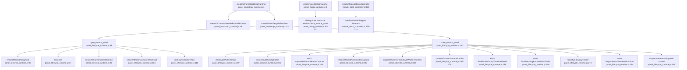

# Call Graph - panel-lifecycle

```mermaid
flowchart TD
  Bootstrap["createUiPanelBootstrapRuntime\npanel_bootstrap_runtime.js:4"] --> Controls["createUiControlsHeaderBundleRuntime\npanel_bootstrap_runtime.js:29"]
  Bootstrap --> Lifecycle["createPanelLifecycleRuntime\npanel_bootstrap_runtime.js:103"]
  Lifecycle --> Open["open_mtrack_panel\npanel_lifecycle_runtime.js:93"]
  Open --> Root["ensureMtrackDialogRoot\npanel_lifecycle_runtime.js:96"]
  Open --> EnsureUi["ensureUi\npanel_lifecycle_runtime.js:97"]
  Open --> Renderer["ensureMtraxRendererRuntime\npanel_lifecycle_runtime.js:99"]
  Open --> Layer["ensureMtrackPanelLayerContract\npanel_lifecycle_runtime.js:104"]
  Open --> Display["root.style.display='flex'\npanel_lifecycle_runtime.js:115"]

  Lifecycle --> Close["close_mtrack_panel\npanel_lifecycle_runtime.js:163"]
  Close --> Deactivate["deactivateActiveGroup\npanel_lifecycle_runtime.js:199"]
  Close --> TextCommit["closeActiveTextClipEditor\npanel_lifecycle_runtime.js:216"]
  Close --> StopRecord["await stopMediaRecordActionCapture\npanel_lifecycle_runtime.js:224"]
  Close --> ReleaseVideo["releaseRecordActionVideoCapture\npanel_lifecycle_runtime.js:227"]
  Close --> Worker["disposeRuntimeFrameEvalWorkerRuntime\npanel_lifecycle_runtime.js:228"]
  Close --> Audio["pause/dispose hmtracks audio\npanel_lifecycle_runtime.js:232-235"]
  Close --> Persist["await flushActiveGroupTimelinePersist\npanel_lifecycle_runtime.js:239"]
  Close --> Pending["await flushPendingAtomePersistTasks\npanel_lifecycle_runtime.js:246"]
  Close --> Hide["root.style.display='none'\npanel_lifecycle_runtime.js:270"]
  Close --> DisposeRenderer["await disposeMtraxRendererRuntime\npanel_lifecycle_runtime.js:294"]
  Close --> Event["dispatch eve:mtrack-panel-closed\npanel_lifecycle_runtime.js:301"]

  Dialog["createPanelDialogRuntime\npanel_dialog_runtime.js:3"] --> DialogClose["dialog close button -> window.close_mtrack_panel\npanel_dialog_runtime.js:50-53"]
  Dock["createMoleculeDockController\nmtrack_dock_controller.js:105"] --> ResizeListeners["window/visualViewport listeners\nmtrack_dock_controller.js:253-272"]
```
