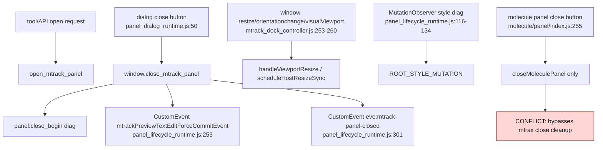

# Event Graph - panel-lifecycle

```mermaid
flowchart TD
  ToolOpen["tool/API open request"] --> Open["open_mtrack_panel"]
  DialogButton["dialog close button\npanel_dialog_runtime.js:50"] --> Close["window.close_mtrack_panel"]
  Close --> CloseBegin["panel:close_begin diag"]
  Close --> ForceTextCommit["CustomEvent mtrackPreviewTextEditForceCommitEvent\npanel_lifecycle_runtime.js:253"]
  Close --> ClosedEvent["CustomEvent eve:mtrack-panel-closed\npanel_lifecycle_runtime.js:301"]
  DockResize["window resize/orientationchange/visualViewport\nmtrack_dock_controller.js:253-260"] --> DockLayout["handleViewportResize / scheduleHostResizeSync"]
  Mutation["MutationObserver style diag\npanel_lifecycle_runtime.js:116-134"] --> Diag["ROOT_STYLE_MUTATION"]

  MoleculeClose["molecule panel close button\nmolecule/panel/index.js:255"] --> MoleculeHide["closeMoleculePanel only"]
  MoleculeHide --> Conflict["CONFLICT: bypasses mtrax close cleanup"]:::risk

  classDef risk fill:#ffd6d6,stroke:#a80000,color:#111
```
