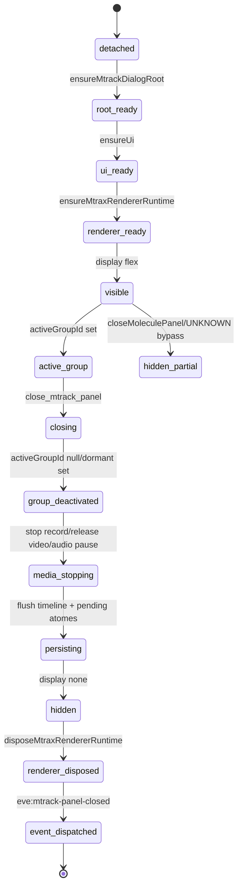

# State Graph - panel-lifecycle

```mermaid
stateDiagram-v2
  [*] --> detached
  detached --> root_ready: ensureMtrackDialogRoot
  root_ready --> ui_ready: ensureUi
  ui_ready --> renderer_ready: ensureMtraxRendererRuntime
  renderer_ready --> visible: display flex
  visible --> active_group: activeGroupId set
  active_group --> closing: close_mtrack_panel
  closing --> group_deactivated: activeGroupId null/dormant set
  group_deactivated --> media_stopping: stop record/release video/audio pause
  media_stopping --> persisting: flush timeline + pending atomes
  persisting --> hidden: display none
  hidden --> renderer_disposed: disposeMtraxRendererRuntime
  renderer_disposed --> event_dispatched: eve:mtrack-panel-closed
  event_dispatched --> [*]
  visible --> hidden_partial: closeMoleculePanel/UNKNOWN bypass
```
