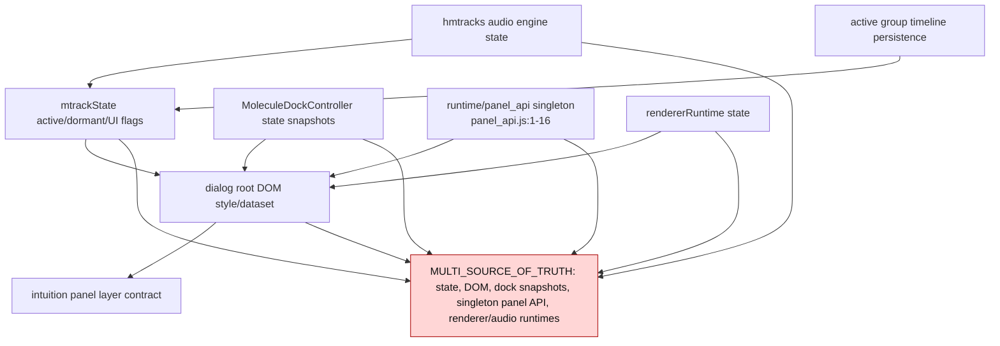

# Source-of-Truth Graph - panel-lifecycle

```mermaid
flowchart TD
  MtrackState["mtrackState active/dormant/UI flags"] --> Root["dialog root DOM style/dataset"]
  Root --> Layer["intuition panel layer contract"]
  DockState["MoleculeDockController state snapshots"] --> Root
  PanelApi["runtime/panel_api singleton\npanel_api.js:1-16"] --> Root
  Renderer["rendererRuntime state"] --> Root
  Audio["hmtracks audio engine state"] --> MtrackState
  Persistence["active group timeline persistence"] --> MtrackState

  Multi["MULTI_SOURCE_OF_TRUTH: state, DOM, dock snapshots, singleton panel API, renderer/audio runtimes"]:::risk
  MtrackState --> Multi
  Root --> Multi
  DockState --> Multi
  PanelApi --> Multi
  Renderer --> Multi
  Audio --> Multi

  classDef risk fill:#ffd6d6,stroke:#a80000,color:#111
```
