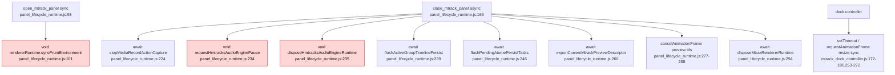

# Async Graph - panel-lifecycle

```mermaid
flowchart TD
  Open["open_mtrack_panel sync\npanel_lifecycle_runtime.js:93"] --> SyncEnv["void rendererRuntime.syncFromEnvironment\npanel_lifecycle_runtime.js:101"]:::risk
  Close["close_mtrack_panel async\npanel_lifecycle_runtime.js:163"] --> StopRecord["await stopMediaRecordActionCapture\npanel_lifecycle_runtime.js:224"]
  Close --> PauseAudio["void requestHmtracksAudioEnginePause\npanel_lifecycle_runtime.js:234"]:::risk
  Close --> DisposeAudio["void disposeHmtracksAudioEngineRuntime\npanel_lifecycle_runtime.js:235"]:::risk
  Close --> Flush["await flushActiveGroupTimelinePersist\npanel_lifecycle_runtime.js:239"]
  Close --> Pending["await flushPendingAtomePersistTasks\npanel_lifecycle_runtime.js:246"]
  Close --> Export["await exportCurrentMtrackPreviewDescriptor\npanel_lifecycle_runtime.js:260"]
  Close --> CancelRaf["cancelAnimationFrame preview ids\npanel_lifecycle_runtime.js:277-288"]
  Close --> DisposeRenderer["await disposeMtraxRendererRuntime\npanel_lifecycle_runtime.js:294"]
  Dock["dock controller"] --> Timers["setTimeout / requestAnimationFrame resize sync\nmtrack_dock_controller.js:172-180,253-272"]

  classDef risk fill:#ffd6d6,stroke:#a80000,color:#111
```
